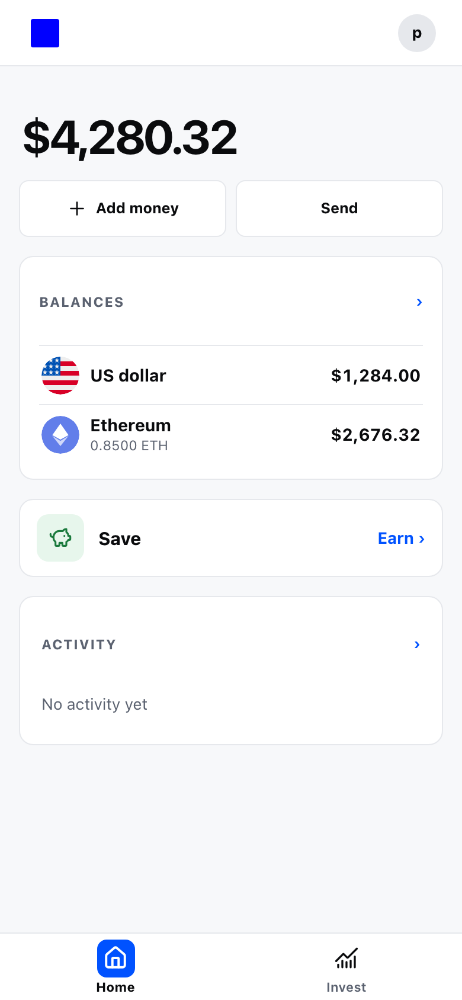
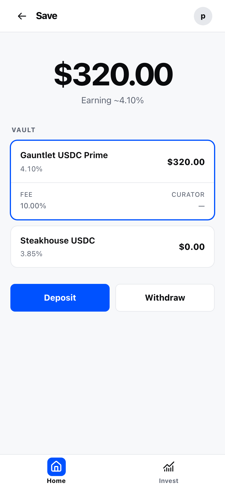
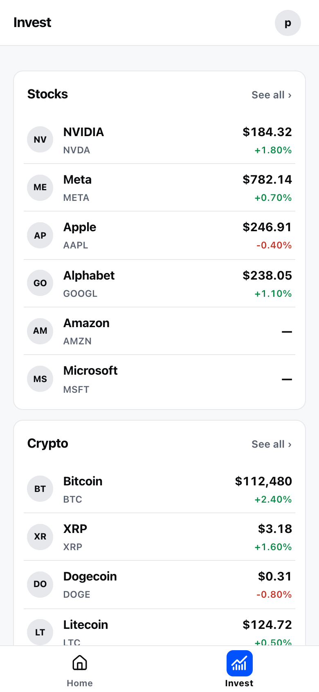
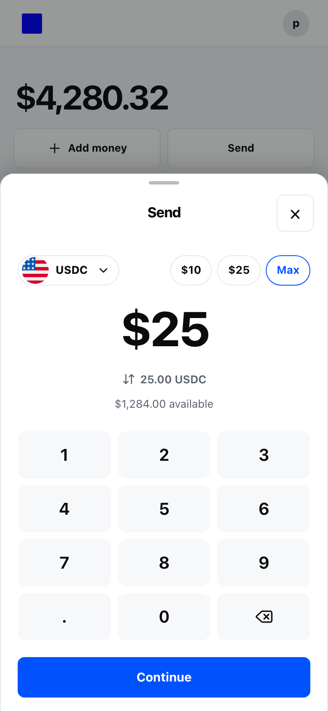

# Home

**The WordPress for neobanks.**

Open-source software for building your own global money app.

Build for your community, customers, or country. Start with a mobile-first app on Base, then make it yours with your brand, local currencies, assets, and providers.

> **Development status:** Home is under active development. See [build status](docs/build-status.md) before considering a real-money deployment.

## Start with Home. Make it yours.

Fork the repository, customize the product and provider seams, and deploy with your own provider accounts.

## Vision

Home is building toward a complete money app:

- **Hold, send, and receive** money across currencies and assets.
- **Earn** across currencies and assets.
- **Invest** across asset classes.
- **Borrow** against your assets, in the asset or currency you need.

## Product

Real browser captures of the current app with sample data. Select an image for full size.

<table>
  <tr>
    <td align="center">
      <a href="docs/readme/home.png"></a><br>
      <strong>Home</strong>
    </td>
    <td align="center">
      <a href="docs/readme/save.png"></a><br>
      <strong>Save</strong>
    </td>
  </tr>
  <tr>
    <td align="center">
      <a href="docs/readme/invest.png"></a><br>
      <strong>Invest</strong>
    </td>
    <td align="center">
      <a href="docs/readme/send.png"></a><br>
      <strong>Send</strong>
    </td>
  </tr>
</table>

Capture provenance and regeneration instructions are in [`docs/readme/`](docs/readme/README.md).

## Customize it

Home keeps the main operator seams in typed configuration and server boundaries:

| Customize | Start here |
| --- | --- |
| Brand, metadata, colors, and navigation | `apps/web/config/brand.ts`, `apps/web/app/globals.css`, `apps/web/config/navigation.ts` |
| Countries and local-currency presentation | `apps/web/config/regions.ts` |
| Wallet, savings, and Invest asset catalogs | `apps/web/config/portfolio-assets.ts`, `apps/web/shared/savings/config.ts`, `apps/web/config/invest-assets.ts` |
| Account, data, funding, and protocol providers | `apps/web/server/` and the matching setup guides in `docs/` |

Read [Fork and extend](docs/fork-and-extend.md) before publishing a customized deployment. Country selection changes presentation and formatting; executable routes still depend on your provider configuration and eligibility.

## Get started

### Prerequisites

- [Bun](https://bun.sh/) **1.3.12**, pinned by `packageManager`.
- Node.js **22.13 or newer**.

### Install and run

```sh
git clone https://github.com/jessepollak/home.git
cd home
bun install --frozen-lockfile

if [ ! -e apps/web/.env.local ]; then
  cp .env.example apps/web/.env.local
fi

bun dev
```

Open `http://localhost:3000`. Use the canonical `localhost` origin rather than `127.0.0.1`.

You can browse public product surfaces without credentials. Email sign-in, authenticated balances, and money actions require your own CDP project and allowed local origin; follow [CDP setup](docs/cdp-setup.md). Never commit secrets or expose server keys with a `NEXT_PUBLIC_` prefix.

Money actions require PostgreSQL via `DATABASE_URL` and `MONEY_ACTION_POSTGRES_CUTOVER=verified-empty` after unresolved legacy SQLite actions and references are verified empty. Apply the migrations and read [Vercel deploy](docs/vercel-deploy.md). Trading intents use a separate persistence boundary documented in [build status](docs/build-status.md).

### Useful commands

```sh
bun test       # deterministic unit and contract tests
bun lint       # ESLint
bun typecheck  # generated route types and strict TypeScript
bun build      # production builds
bun check      # test, lint, typecheck, and build
```

## Current availability

The repository currently includes local-currency portfolio presentation; USDC and ETH send/receive flows; indexed activity; public Morpho USDC vault data and authenticated Save actions; multi-asset Invest discovery with an email-controlled crypto trade flow; and one bounded USDC-against-cbBTC Borrow market ([full-size capture](docs/readme/borrow.png)). Stock trading and broader borrow or currency support are not yet implemented. See [build status](docs/build-status.md) for the exact scope.

## Repository map

| Place | Purpose |
| --- | --- |
| `apps/web/app/` | Next.js routes, metadata, and global styles |
| `apps/web/client/` | Product experiences for Home, account, activity, funding, Save, Invest, transfers, and Borrow |
| `apps/web/shared/` | Runtime-independent contracts, validation, math, formatting, and presenters |
| `apps/web/server/` | Authenticated provider, protocol, persistence, and money-action boundaries |
| `apps/web/config/` | Brand, region, navigation, asset, and presentation configuration |
| `packages/ui/` | Shared UI primitives and tokens |
| `apps/design-system/` | UI package documentation and browser examples |
| `docs/` | Setup, deployment, runtime boundaries, product status, and extension guides |

**Stack:** Next.js, React, TypeScript, Tailwind CSS, Bun, Base, CDP, Morpho, and PostgreSQL for money-action persistence.

## Contributing

Focused upstream changes are welcome. Read [CONTRIBUTING](CONTRIBUTING.md), keep credentials and funded-wallet secrets out of Git, and run `bun check` before opening a pull request.

## License

Original repository content is licensed under [MIT](LICENSE). Third-party materials, provider SDKs, fonts, and trademarks keep their own terms.

The Home mark's font provenance and reuse constraints are documented in [`apps/web/public/home-mark/PROVENANCE.md`](apps/web/public/home-mark/PROVENANCE.md). Do not assume the Home mark, its fonts, or Base-related marks are covered by the MIT license.
