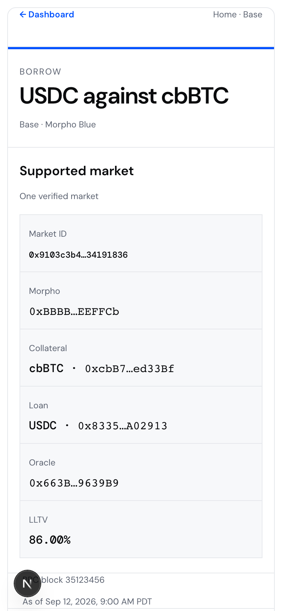

# Home

**The WordPress for neobanks.**

Open-source software for building your own global money app.

Home gives builders a mobile-first money app on Base that they can fork and make their own. Customize the brand, local currencies, assets, and providers for your community, your customers, or your country—without starting the product and wallet experience from zero.

> **Development status:** Home is under active development, not a production-approved money app. A real-money deployment requires your own provider configuration, verified account and route eligibility, and end-to-end acceptance. See [current availability](#current-availability) and [build status](docs/build-status.md).

## Why Home

People experience money locally: the currency they earn, the assets they can access, and the providers available where they live. Most financial apps are built as closed products for one market. Home is built as a starting point for builders.

Fork the repository, keep the mobile product foundation, and replace the parts that make a money app local:

- your name, identity, colors, and product language;
- the countries and currencies you present;
- the assets and financial products you support;
- the account, funding, data, and protocol providers you operate.

Home is software, not a bank-in-a-box. It does not supply licenses, custody, universal provider access, or a one-click production launch.

## Vision

**This is the product direction, not a claim about everything supported today.** Home is building toward a global money app where people can:

- **HOLD, SEND, and RECEIVE** money in their currency;
- **EARN** on their money across currencies;
- **INVEST** across asset classes;
- **BORROW** against their assets, in the asset or currency they need.

The current implementation is narrower and intentionally explicit about what is available.

## Product

These are real 390px browser captures of the current app, rendered with the repository's Playwright smoke account boundary and local sample API data. They contain no live account, wallet, credentials, funds, external provider requests, signatures, or submissions. Select any image for the full-size capture.

<table>
  <tr>
    <td align="center">
      <a href="docs/readme/home.png"></a><br>
      <strong>Home</strong><br><sub>Sample data</sub>
    </td>
    <td align="center">
      <a href="docs/readme/save.png"></a><br>
      <strong>Save</strong><br><sub>Sample data</sub>
    </td>
    <td align="center">
      <a href="docs/readme/invest.png"></a><br>
      <strong>Invest</strong><br><sub>Sample data</sub>
    </td>
  </tr>
  <tr>
    <td align="center">
      <a href="docs/readme/send.png"></a><br>
      <strong>Send</strong><br><sub>Sample data</sub>
    </td>
    <td align="center">
      <a href="docs/readme/borrow.png"></a><br>
      <strong>Borrow</strong><br><sub>Sample data</sub>
    </td>
  </tr>
</table>

Capture provenance and regeneration instructions are in [`docs/readme/`](docs/readme/README.md).

## Customize it

Home keeps the main operator seams in typed configuration and server boundaries:

| Customize | Start here |
| --- | --- |
| Brand, metadata, colors, and navigation | `apps/web/config/brand.ts`, `apps/web/app/globals.css`, `apps/web/config/navigation.ts` |
| Countries and local-currency presentation | `apps/web/config/regions.ts` |
| Wallet, savings, and Invest asset catalogs | `apps/web/config/portfolio-assets.ts`, `apps/web/shared/savings/config.ts`, `apps/web/config/invest-assets.ts` |
| Account, data, funding, and protocol providers | `apps/web/server/` and the matching setup guides in `docs/` |

Read [Fork and extend](docs/fork-and-extend.md) before publishing a customized deployment. Country selection in the app changes presentation and formatting; it does not establish eligibility, residency, or an executable funding route.

## Get started

### Prerequisites

- [Bun](https://bun.sh/) **1.3.12**, pinned by `packageManager`.
- Node.js **22 or newer**.

### Install and run

```sh
git clone https://github.com/jessepollak/home.git
cd home
bun install --frozen-lockfile

if [ ! -e apps/web/.env.local ]; then
  cp .env.example apps/web/.env.local
fi

bun dev
```

Open `http://localhost:3000`. Use the canonical `localhost` origin rather than `127.0.0.1`.

You can browse the public product surfaces without credentials. Email sign-in, authenticated balances, and money actions require your own CDP project and allowed local origin; follow [CDP setup](docs/cdp-setup.md). Never commit secrets or expose server keys with a `NEXT_PUBLIC_` prefix.

Money actions fail closed unless PostgreSQL is configured with `DATABASE_URL` and `MONEY_ACTION_POSTGRES_CUTOVER=verified-empty` after unresolved legacy SQLite actions and references have been verified empty. Apply the migrations and read [Vercel deploy](docs/vercel-deploy.md) before exercising those flows. The trading-intent runtime has a separate persistence boundary; [build status](docs/build-status.md) is the current source of truth.

### Useful commands

```sh
bun test       # deterministic unit and contract tests
bun lint       # ESLint
bun typecheck  # generated route types and strict TypeScript
bun build      # production builds
bun check      # test, lint, typecheck, and build
```

## Current availability

Today, the repository includes local-currency portfolio presentation; USDC and ETH send/receive flows; indexed activity; public Morpho USDC vault data and authenticated Save actions; multi-asset Invest discovery with an email-controlled crypto trade flow; and one bounded USDC-against-cbBTC Borrow market.

That is not universal product support. Stock trading is not enabled, broader borrow markets and currencies are not implemented, provider availability is operator-specific, and no live funded end-to-end or production acceptance is implied. See [build status](docs/build-status.md) for the exact implemented scope and remaining gates.

## Repository map

| Place | Purpose |
| --- | --- |
| `apps/web/app/` | Next.js routes, metadata, and global styles |
| `apps/web/client/` | Product experiences for Home, account, activity, funding, Save, Invest, transfers, and Borrow |
| `apps/web/shared/` | Runtime-independent contracts, validation, math, formatting, and presenters |
| `apps/web/server/` | Authenticated provider, protocol, persistence, and money-action boundaries |
| `apps/web/config/` | Brand, region, navigation, asset, and presentation configuration |
| `packages/ui/` | Shared UI primitives and tokens |
| `apps/design-system/` | UI package documentation and browser examples |
| `docs/` | Setup, deployment, runtime boundaries, product status, and extension guides |

**Stack:** Next.js, React, TypeScript, Tailwind CSS, Bun, Base, CDP, Morpho, and PostgreSQL for money-action persistence. Provider and protocol integrations remain bounded by their setup, eligibility, and validation requirements.

## Contributing

Focused upstream changes are welcome. Read [CONTRIBUTING](CONTRIBUTING.md), keep credentials and funded-wallet secrets out of Git, and run `bun check` before opening a pull request.

## License

Original repository content is licensed under [MIT](LICENSE). Third-party materials, provider SDKs, fonts, and trademarks keep their own terms.

The Home mark's font provenance and reuse constraints are documented in [`apps/web/public/home-mark/PROVENANCE.md`](apps/web/public/home-mark/PROVENANCE.md). Do not assume the Home mark, its fonts, or Base-related marks are covered by the MIT license.
