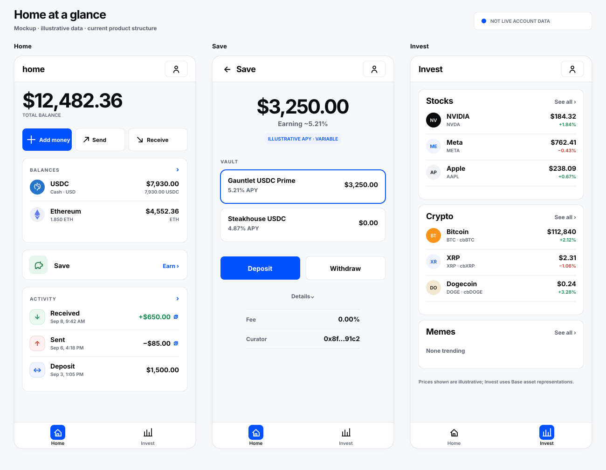
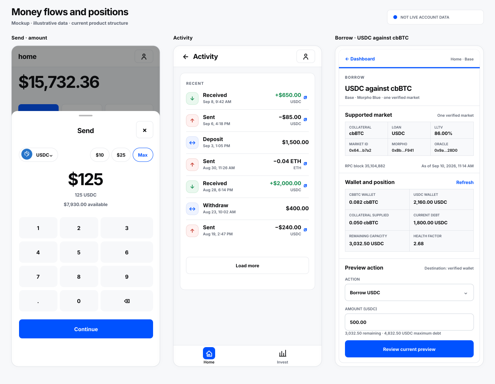

# home

An open-source home for your money on Base.

Home is a mobile-first financial app built around local currencies. See your balances, send and receive money, save in USDC, explore investments, and borrow against bitcoin collateral—with the asset, amount, and network made explicit before you confirm.

> **Status:** Home is under active development, not a production-approved money app. Real-money use requires your own provider configuration, verified account and route eligibility, and end-to-end acceptance. See [build status](docs/build-status.md) for implementation and validation details.

## UI mockups

These mockups follow the current UI. Balances, prices, and rates are illustrative—not live account data or proof of production availability. Open either image to inspect the full-size screens.

[](docs/readme/overview.svg)

*Home brings balances and everyday actions together; Save shows USDC vaults; Invest makes assets discoverable.*

[](docs/readme/flows.svg)

*Send uses a stepped amount-and-review flow; Activity tracks transfers; Borrow is limited to USDC against cbBTC.*

## What is here

- **Home:** local-currency valuation for the configured wallet and savings inventory, plus funding, USDC/ETH send and receive, and indexed activity.
- **Save:** public Morpho vault information and authenticated USDC deposit/withdrawal flows.
- **Invest:** crypto discovery and email-controlled trade preparation/execution. The Stocks interface is informational; stock trading is not enabled.
- **Borrow:** one bounded cbBTC/USDC Morpho market with collateral, borrow, repay, and withdrawal flows. It requires a compatible deployed account; counterfactual simulation and live funded execution have not been accepted.

Country selection changes presentation and formatting; it is not an eligibility, residency, or funding decision. The Ripio funding integration is in progress and is not enabled in this checkout. Documented assets and provider support are not proof of an executable route.

## Get started

Clone the repository and install the pinned dependencies:

```sh
git clone https://github.com/jessepollak/home.git
cd home
bun install --frozen-lockfile
```

### Prerequisites

- **Bun 1.3.12**, pinned by `packageManager`.
- **Node.js 22.13+** for local SQLite persistence (`node:sqlite`); Node 24 was used for local validation.

### Environment

Create the gitignored local environment file only when it does not already exist:

```sh
if [ ! -e apps/web/.env.local ]; then
  cp .env.example apps/web/.env.local
fi
```

Never commit secrets. Server keys stay server-only—do not give them a `NEXT_PUBLIC_` prefix.

| You can browse without CDP credentials | You need your own CDP project and configured origin |
| --- | --- |
| Landing, public Morpho vault reads, and informational Invest | Email sign-in, session validation, authenticated balances, and money actions |

For CDP-backed flows, set `NEXT_PUBLIC_CDP_PROJECT_ID`, `CDP_API_KEY_ID`, and `CDP_API_KEY_SECRET` from your project, then allow the exact local origin `http://localhost:3000`. See [CDP setup](docs/cdp-setup.md) for the complete configuration, including preview origins.

### Run locally

```sh
bun dev
```

Open `http://localhost:3000`. Development navigation from `127.0.0.1` redirects to the canonical `localhost` origin.

Local `bun dev` uses a private SQLite money-action store under `.local/` when `DATABASE_URL` is unset. Hosted persistence uses server-only `DATABASE_URL` with Neon/Postgres instead; no hosted database is required to browse locally. Read [wallet runtime](docs/wallet-runtime-spike.md) and [Vercel deploy](docs/vercel-deploy.md) before deploying money actions.

### Useful commands

```sh
bun test       # deterministic unit and contract tests
bun lint       # ESLint
bun typecheck  # Next route types and strict TypeScript
bun build      # production build
bun check      # test, lint, typecheck, and build
```

## Repository map

| Place | Purpose |
| --- | --- |
| `apps/web/app/` | Thin Next.js route entrypoints and global styles |
| `apps/web/client/` | Home, account, activity, funding, savings, invest, and borrowing UI |
| `apps/web/shared/` | Runtime-agnostic contracts, validation, formatting, and pure presenters |
| `apps/web/server/` | Server-side provider, money-action, and protocol boundaries |
| `apps/web/config/` | Brand, regions, navigation, asset, and presentation configuration |
| `docs/` | Setup, runtime, product intent, deployment, and extension notes |

**Stack:** Next.js, TypeScript, Tailwind, and Bun; SQLite for local money actions and Neon/Postgres for hosted persistence. CDP supplies account and wallet capabilities, Base RPC supplies chain reads, and Morpho supplies savings and the supported borrowing market.


## Forking

Home is intended to be cloned and adapted. Replace the brand, regions, asset selection, and providers with your own configuration. Each operator supplies their own provider projects, credentials, persistence, and deployment. [Fork and extend](docs/fork-and-extend.md) maps the supported seams; [the docs index](docs/README.md) collects setup and runtime guides.

## Contributing

Focused upstream changes are welcome. Read [CONTRIBUTING](CONTRIBUTING.md) and run `bun check` before opening a pull request. Keep credentials and funded-wallet secrets out of Git.

## License

Original repository content is licensed under [MIT](LICENSE). Third-party materials, provider SDKs, fonts, and trademarks keep their own terms. In particular, the Home mark’s font provenance and reuse constraints are documented in [`apps/web/public/home-mark/PROVENANCE.md`](apps/web/public/home-mark/PROVENANCE.md); do not assume those assets or Base-related marks are covered by MIT.
