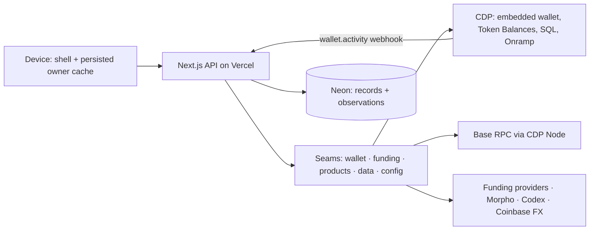

# Architecture

Jesse-locked, September 13, 2026. This is the one normative architecture document: where another doc disagrees, this one wins. It absorbs [home-is-thin](home-is-thin.md) (now the actions subsystem doc, [actions.md](actions.md)) and demotes [target-architecture.md](target-architecture.md) to the historical build plan. Subsystem designs: [actions](actions.md), [balances](balances.md), [funding provider seam](funding-provider-seam.md), [regional money](regional-money.md).

## Thesis

Home is the WordPress for neobanks: a small, stablecoin-native money-app core on Base plus typed seams that forks fill with their own brand, countries, assets, and providers. WordPress lasted because its core is tiny and never changes shape, everything else plugs into stable seams, and anyone can host it. Home holds that line for money.

Everything inside the core is a token on Base: accounts are smart accounts; holdings are tokens identified by chain + address with `bigint` amounts; cash is a stablecoin shown in its own fiat; totals are estimates in the user's presentation currency. Fiat exists only inside edge plugins that deliver 1:1 stablecoins — onramps, offramps, and cards, which spend from a stablecoin balance. The chain is the ledger of record. Home remembers only what it alone knows and what it last saw.

## Principles

1. **Stablecoins in, stablecoins everywhere, stablecoins out.** No fiat balance, fiat ledger, or bank reconciliation in the core. A provider that touches fiat plugs in at an edge and hands the core a token on Base. The funding seam is the template for every edge: manifest + adapter + conformance test, and the core owns the parts that can lose money (destination, token identity, one dispatch, what counts as received).
2. **The chain is the truth; Home remembers two things and never confuses them.** A *record* is what Home's server could not ask a provider for again: a user's confirmed action, a funding order, a provider handle once learned, a receipt Home verified and acted on. An *observation* is what it can ask for again: a balance at a block, a price at a time, a provider's current order status. Observations carry their source position and can be dropped; records cannot be reconstructed. A record may carry observation columns; an observation never carries record columns. Nothing authorizes a money action from an observation — the server reads the chain itself at prepare time.
3. **Small core, typed seams, compile-time plugins.** One directory plus one registration line adds a provider, product, region, or asset. The core changes only for a new *kind* of thing. No runtime plugin loading.
4. **Fork-first, Vercel-first.** Runs locally with Docker Postgres and Base Account sign-in, no CDP project. Every provider is optional and degrades to "unavailable" with a setup message. Configuration is typed, validated, and versioned; credentials live only in deployment secrets; no upstream telemetry. One deploy target: Vercel plus Marketplace Neon. Migrations are additive after first public launch; before it, the database may be dropped and recreated.
5. **Measured, honest quality.** Performance marks with CI budgets; Playwright smoke on every preview; unavailable is never zero; stale is served as stale with its age; a partial read is labelled partial. Beautiful means minimal: no decorative copy, no compliance text on product screens, one row component and one formatting module.

The five money invariants are not derived from these principles; they are the floor no PR crosses: server-authored calldata · verified scope · `bigint` amounts · idempotency key = action id · owner-generation fence.

### The thinness test

Before adding persistence, a route, a poll, a runtime, or a dependency, answer in order. Any question can reject; the order is for classification, not for stopping early.

0. Does a provider already do this? Call it; do not rebuild it.
1. Can a provider give it back on demand? Then it is an observation: store it once, at the granularity of its source (a price per asset, a balance per address), with its source position, droppable, never authorized from.
2. Does it change on an event Home can see (own action, webhook)? Invalidate on the event; a TTL is only the backstop for a missed signal.
3. Is there a shipped feature that must act while no user is present? If not, no new runtime — no cron, queue, socket, or indexer.
4. Can an existing shape carry it? Add a field or a stage, not a second contract.

Applied: a second savings-positions endpoint → 4 rejects. Ponder → 0 and 3 reject (CDP SQL and Token Balances already index). SSE → 3 rejects. A per-owner price cache → 1 and 4 reject. An intent ledger → 0 (CDP idempotency) and 4 reject. The balance snapshot row, the CDP webhook route, and the funding tables → admitted.

## Boundaries

The API validates the session, resolves the one smart account the caller may act for, and invokes a seam. It never receives keys or unrestricted signing authority; the user signs in the browser. Private responses are `Cache-Control: private, no-store`.

## Core model

| Type | Meaning |
|---|---|
| Asset | chain id + lowercase contract address, or the native discriminator; never a ticker |
| Amount | asset + integer base units; `bigint` in code, decimal-integer strings on the wire |
| Holding | an asset the account holds, with provenance (registry, catalog, wallet), a balance at a block, and a value at a time |
| Action | a user-initiated onchain operation Home prepared, the user signed, and Home tracks by one id |
| Order | a funding operation at an edge, created against a provider and settled by a verified receipt |
| Presentation currency | the fiat the user reads totals in; changes presentation, never holdings |

Each economic position counts once: vault shares are valued as a position, not again as their underlying; collateral is not liquid cash; a card's stablecoin balance is a holding, not a second total.

## Seams

| Seam | Core owns | Plugin provides | Where |
|---|---|---|---|
| Wallet | session verification, owner fence, one action id | sign-in, signing, `sendCalls`, status lookup | `client/account`, `server/auth` |
| Funding | destination, token identity, one dispatch per order, receipt rule | quotes, KYC fields, payment instructions, provider status | `server/funding/providers/<id>/{manifest,adapter}.ts` |
| Products | calldata issuance, exact approvals, position valuation | enter / exit / position / rate for a vault, market, or instrument | `server/savings`, `server/borrowing` (to converge on one adapter shape) |
| Data | the holding shape, pinned registry reads, the valuation math | enumeration (CDP Token Balances), catalog and prices (Codex), FX (Coinbase), history (CDP SQL) | `server/balances`, `server/market-data`, `server/chain`, `server/chain-data` |
| Config | validation, defaults, precedence rules | brand, regions and currencies, asset registries, navigation, feature flags | `apps/web/config/*`, `shared/assets/base.ts` |

Adding a plugin means copying the simplest existing directory in that seam, passing its conformance test (the funding seam's `describeFundingAdapter` is the pattern), and adding one line to the seam's index. Shared code changes only when a country, token, instruction kind, or product kind is new.

## Data model

| Table | Kind | Why it exists |
|---|---|---|
| `actions` | record | a confirmed action survives reload and shows in Activity before the indexer catches up; status is derived at read time, never stored ([actions.md](actions.md)) |
| `funding_orders` | record | a provider order and its verified receipt ([funding seam](funding-provider-seam.md)) |
| `balance_snapshots` | observation | the last observed holdings per `(chain_id, address)` at a block; invalidated by Home's own actions and CDP activity webhooks; TTL only as backstop; served as observed, with its age, when a refresh fails ([balances.md](balances.md)) |
| `schema_migrations` | — | makes `bun run db:migrate` idempotent |

One shared executor (`server/db/sql.ts`) serves every table. Authentication creates no rows: the SIWE challenge is a signed cookie. Country preference is device-side until a server-rendered shell needs it, then it becomes a record. Prices are never stored per owner.

## Flows

Everything Home does is one of two flows.

- **Action** (onchain; the user signs): `prepare` → server verifies scope, reads the account's registry balances at a pinned block, validates amounts, builds calldata with exact approvals, stores the draft → `confirm` → the browser dispatches through the wallet seam with the action id as idempotency key → `handle` records the provider handle and, later, the transaction hash → status derives from the receipt. Detail and SDK-verified retry semantics: [actions.md](actions.md).
- **Order** (offchain edge; the provider reports): `quote` → `create` → user pays offchain → provider webhook or poll → Home verifies the onchain receipt and marks the order received. Detail: [funding seam](funding-provider-seam.md).

Balances are a read pipeline, not a flow: enumerate (CDP) → resolve (registry ∪ catalog ∪ wallet) → read (pinned multicall) → price. Detail: [balances.md](balances.md).

## Client

Three caches, one client. The device paints first from a persisted, owner-scoped TanStack cache (every row the server sent, stored whole; cleared on every owner-generation bump); the server answers from the snapshot row and global short-TTL price caches; the chain and providers are the source. The device revalidates on focus, on mount past `staleTime`, and on a visible-tab interval; the server re-observes on events and the backstop. No layer fabricates a quantity the layer behind it did not produce.

One shell stays mounted; flows are shallow-routed and URL-addressable through one inbound allowlist. One query client, owner-prefixed keys, one owner fence (synchronous ref; captured at prepare, re-checked before every provider call and server POST; bumps on sign-in, sign-out, provider switch, account or chain change, lost verification). One row component and one formatting module render every amount; features select from shared snapshots and never re-query what a selector gives them. Send and Save take their maxima from the snapshot even when stale — the age is shown beside the max, and the server's pinned read at prepare is the authority. Dust is hidden by default with a per-device "show all".

## Quality bar

Marks: `shell:paint`, `session:verified`, `wallet:ready`, `balances:painted` (fires on `ready` only), `action:first-interactive`; CI budgets `balances:painted`. Playwright smoke runs on every preview against a fixture provider. Frame budget: never `setState` per pointer move or price tick. UI direction: direct and minimal; actionable review facts on confirm screens only; disclosures live under Account.

## Fork and contribution contract

A fork changes `apps/web/config/*`, public assets, and plugins under the seams — never the core. It provisions its own Vercel project, Neon database, CDP project, and provider accounts; it never points at another operator's database or provider project. Upgrades flow through the configuration schema version and additive migrations. Contributions land as one directory per plugin with its README and conformance test; docs ship beside code; GitHub Issues on `jessepollak/home` are the only board ([operating manual](operating-manual.md)).

## Non-goals

Anything that is not a token on Base, not one of the two flows, or not reachable through a seam: a fiat ledger, KYC document storage, a card ledger, custom contracts, multichain routing, a runtime plugin marketplace, a second UI kit, a money-action state machine, an intent ledger, a `plan_hash`, a self-hosted indexer, a cron, a queue, a socket.

## Failure modes we accept

- Send succeeded, handle post lost, tab closed: the action reads `unknown`; Activity shows it when indexed; it ages out at 24 h.
- Owner switch mid-flight: the fence drops the work before the next call.
- Provider outage: the provider's error is shown; balances show the last observation marked stale with its age.
- Missed webhook: an external transfer appears within the 120 s backstop plus CDP index lag.
- Indexer latency bounds the `unknown` window; constants are tuned on preview.

## Test policy

Test Home's logic: calldata issuance (exact approvals and amounts), auth scope, amount parsing and formatting, derived status (table-driven), the owner fence, selectors and presenters, and UI behavior that would be a bug if broken. Never re-test CDP, Base Account, Next, motion, or happy-dom. No real sleeps; no assertions on source text; matrices are table-driven and bounded; one behavior per test. Heuristic: a PR's test code should not exceed its product code, except for status derivation and amount parsing.

## Unverified assumptions

CDP idempotency window and same-key-different-body behavior · keys.coinbase.com duplicate-id behavior for `wallet_sendCalls` · indexer latency · CDP Token Balances index lag after a send · CDP Node request budget · `wallet.activity.multi` payload and address-packing behavior. Each is verified once on preview and struck here.
