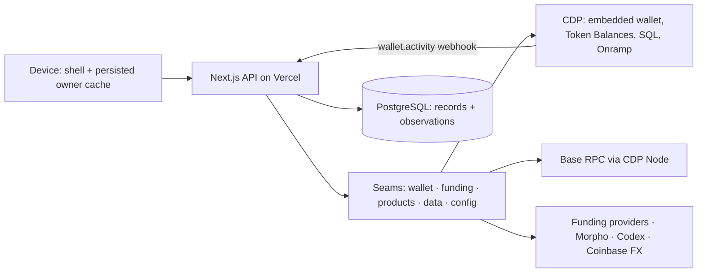

# Architecture

Jesse-locked, September 13, 2026 ([#375](https://github.com/jessepollak/home/issues/375)). The one normative architecture document: where another doc disagrees, this one wins. It states locked direction, not delivery status. Subsystem designs: [actions](actions.md), [balances](balances.md), [Borrow](borrow.md), [funding provider seam](funding-provider-seam.md), [regional money](regional-money.md).

## Thesis

Home is the WordPress for neobanks: a small, stablecoin-native core on Base plus typed compile-time seams that forks fill with their own brand, countries, assets, and providers.

Core financial assets and positions live on Base: accounts are smart accounts; holdings are tokens identified by chain + address with `bigint` amounts; cash is represented by stablecoins shown in their own fiat, never an internal fiat balance; totals are estimates in the user's presentation currency. Fiat custody and payment-rail complexity stay at provider edges — onramps, offramps, and cards, which spend from a stablecoin balance. A stablecoin's denomination does not imply fee-free funding or redemption at par ([regional money](regional-money.md)). The chain is the ledger of record. Home remembers only what it alone knows and what it last saw.

## Principles

1. **Stablecoins in, stablecoins everywhere, stablecoins out.** No fiat balance, fiat ledger, or bank reconciliation in the core. A provider that touches fiat plugs in at an edge and hands the core a token on Base. The funding seam is the template for every edge: manifest + adapter + conformance test, and the core owns the parts that can lose money.
2. **The chain is the truth; Home remembers two things and never confuses them.** A *record* preserves Home-specific intent, association, or commitment that cannot be reconstructed from provider data: a user's confirmed action and the handle and hash linked to it, a funding order and Home's unique claim of the receipt that settled it, or a webhook signing secret that CDP returns only once. An *observation* is replaceable source data at a stated block or time: a balance, a price, a provider's current order status. Observations carry their provenance, may be replicated on the device and the server, and can be dropped; records cannot be reconstructed and may retain observations as evidence. Nothing authorizes a money action from an observation: where calldata depends on chain state (limits, previews, allowances) `prepare` reads it at a pinned block; otherwise the chain's own execution is the check. What is neither record nor observation is not stored: it is signed into a cookie or token, or recomputed.
3. **Small core, typed seams, compile-time plugins.** A provider or product is one directory plus one registration line; a region, currency, or asset is one typed config entry. The core changes only for a new *kind* of thing. No runtime plugin loading.
4. **Fork-first, Vercel-first.** A provider integrator can run the seam they are testing locally with Postgres and Base Account sign-in and no CDP project (`bun run db:up` starts a local PostgreSQL); the full app needs its enabled providers' credentials. Every provider is optional and degrades to "unavailable" with a setup message. Configuration is typed, validated, and versioned; credentials live only in deployment secrets; no upstream telemetry. One deploy target: Vercel plus Marketplace Neon. Migrations run automatically in the production build step and are additive once any shared environment has applied them; before that, the database may be dropped and recreated.
5. **Measured, honest quality.** Performance marks with CI budgets; Playwright smoke on every preview; unavailable is never zero; stale is served as stale with its age; a partial read is labelled partial.

The five money invariants are not derived from these principles; they are the floor no PR crosses: server-authored calldata · verified scope · `bigint` amounts · idempotency key = action id · owner-generation fence.

### The thinness test

Before adding persistence, a route, a poll, a runtime, or a dependency, answer in order. Any question can reject; the order is for classification, not for stopping early.

0. Does a provider already do this? Call it; do not rebuild it.
1. Can the fact be reconstructed from a provider at the granularity you need? Then it is an observation: cache it at its source granularity (a price per asset, a balance per address) with explicit provenance and disposable replicas.
2. Does it change on an event Home can see (own action, webhook)? Invalidate on the event; a TTL is only the backstop for a missed signal.
3. Is there a shipped feature that must act while no user is present? If not, no new runtime — no cron, queue, socket, or indexer.
4. Can an existing shape carry it? Add a field or a stage, not a second contract.

Applied: a second savings-positions endpoint → 4 rejects. Ponder → 0 and 3 reject (CDP SQL and Token Balances already index). SSE → 3 rejects. A per-owner price cache → 1 and 4 reject. An intent ledger → 0 (CDP idempotency) and 4 reject. The balance snapshot row, the CDP webhook route, and the funding tables → admitted.

## Boundaries

An optional, replaceable pre-release deployment-access gate runs before these boundaries. Its signed `home-access` cookie is independent of Home customer identity and future administrator authorization; it creates no user, wallet, staff, support, or configuration authority. Public machine routes remain an explicit path allowlist. Administration composes deployment access when enabled, a verified Home session with a non-null Base smart account, then a separate server-only operator allowlist decision. `/admin` pages reverify only the signed native `home-session` cookie; a CDP render hint or any unverifiable Home session cookie is treated as signed-in but forbidden, never operator proof. `/api/admin/*` verifies the native session or CDP bearer token before evaluating the same allowlist. Unset or malformed allowlists deny all; editing the list and redeploying changes operator access without touching customer sessions or data. Account entry and admin shell presentation await #638.

The API validates the session, resolves the one smart account the caller may act for, and invokes a seam. Scope is the verified subject, its smart account, chain 8453, and the declared provider; nothing in a request body or query widens it. It never receives keys or unrestricted signing authority; the user signs in the browser. Private responses are `Cache-Control: private, no-store`. Route ownership is expressed by `shared/<feature>/contract*.ts` naming and the handler import, not by file headers.

## Core model

| Type | Meaning |
|---|---|
| Asset | chain id + lowercase contract address, or the native discriminator; never a ticker |
| Amount | asset + integer base units; `bigint` in code, decimal-integer strings on the wire |
| Holding | an asset the account holds, with identity and provenance (registry, catalog, wallet), a quantity carrying its source's block or observation time, and a valuation time. Registry quantities share a pinned block; CDP-enumerated quantities do not claim that block |
| Action | a user-initiated onchain operation Home prepared, the user signed, and Home tracks by one id |
| Order | a funding operation at an edge, created against a provider and settled by a verified receipt |
| Presentation currency | the fiat the user reads totals in; changes presentation, never holdings |

Each economic position counts once: vault shares are valued as a position, not again as their underlying; collateral is not liquid cash; a card allocation is not a second holding. Net worth includes collateral and subtracts accrued debt; today's hero is a holdings total, and a net-worth total is a later feature.

## Seams

| Seam | Core owns | Plugin provides | Where |
|---|---|---|---|
| Wallet | session verification, owner fence, one action id | sign-in, signing, `sendCalls`, status lookup | `client/account`, `server/auth` |
| Funding | destination, token identity, one dispatch per order, receipt rule | quotes, KYC fields, payment instructions, provider status | `server/funding/providers/<id>/{manifest,adapter}.ts` |
| Products | supported assets, shared action issuance, exact approvals, valuation rules | product-specific preparation and reads: vault deposits and withdrawals; market collateral and debt operations; trades | `shared/morpho-markets`, `server/morpho-markets` for the verified isolated-market engine; `server/morpho`, `server/savings`, `server/borrowing`, `server/actions/kinds/trade` for product policy and actions; add a broader protocol adapter only when a second protocol demonstrates the contract |
| Data | the holding shape, pinned registry reads, the valuation math | enumeration (CDP Token Balances), catalog and prices (Codex), FX (Coinbase), history (CDP SQL) | `server/balances`, `server/market-data`, `server/chain`, `server/chain-data` |
| Config | validation, defaults, precedence rules | brand, regions, currencies, asset registries, navigation | `apps/web/config/*`, `shared/assets/base.ts`, `shared/*/config.ts` |

Funding already has the full plugin shape: one provider directory, one registration line, one conformance test (`describeFundingAdapter`); Coinbase Onramp and Ripio sit behind it. Coinbase uses the generic Orders API for quote, one create, and status reconciliation, then renders the allowlisted Embedded Orders payment link in an iframe; production still requires Coinbase enablement and verified domains. Apply that shape to another seam when a real extension demonstrates the contract; configuration entries do not need plugin directories. Shared code changes only when an instruction kind or product kind is new.

## Data model

| Table | Kind | Why it exists |
|---|---|---|
| `actions` | record | a confirmed action survives reload and shows in Activity before the indexer catches up; status is derived at read time, never stored ([actions.md](actions.md)) |
| `funding_orders` | record | a provider order and its verified receipt ([funding seam](funding-provider-seam.md)) |
| `funding_provider_customers` | record | the durable provider customer identity and hosted-verification state, one row per owner, account provider, provider, and region; created before terms or KYC writes and never reconstructed by scanning orders ([funding seam](funding-provider-seam.md)) |
| `funding_provider_user_tokens` | record | the encrypted provider-issued verification token returned only on a verified create, one row per account provider, owner, provider, region, and sandbox mode, bound to its destination and reused for at most 55 days; stored only as an authenticated envelope and not reconstructible from orders ([secrets at rest](secrets-at-rest.md)) |
| `balance_snapshots` | observation | the last observed holdings and Borrow positions per `(chain_id, address)`, keeping registry block provenance separate from enumeration time; invalidated by Home's own actions and CDP activity webhooks; TTL only as backstop; served as observed, with its age, when a refresh fails ([balances.md](balances.md) §8) |
| `price_observations` | observation | the newest Codex unit price per asset, shared across owners and used within the display freshness bound when a new instance or failed batch has no fresh quote |
| `valuation_attempts` | observation | the newest valuation attempt per asset and its outcome, so a missing, invalid, stale, or unavailable attempt never erases the last-good price observation ([balances.md](balances.md) §3) |
| `webhook_subscriptions` | record | each app-created CDP subscription and the signing secret returned only at creation, required to authenticate later deliveries |
| `schema_migrations` | — | makes `bun run db:migrate` idempotent |

Every table appears in this inventory with its kind; one shared executor (`server/db/sql.ts`) serves them all. Authentication creates no rows: the SIWE challenge is a signed cookie. Country preference is a device-side record (cookie-readable for server rendering); it moves to the server only for a cross-device need. The server never caches prices per owner. A future history table is decided on its own: reconstructible chain or price history is an observation; what Home displayed or committed to at a time is a record with its own retention contract.

## Flows

Every money mutation is one of two flows; reads, authentication, and preferences are supporting operations.

- **Action** (onchain; the user signs): `prepare` → server verifies scope, reads the relevant balances and positions at a pinned block, validates the requested amount, builds calldata with exact approvals, stores the draft → `confirm` → the browser dispatches through the wallet seam with the action id as idempotency key → `handle` records the provider handle and, later, the transaction hash → status derives from the receipt. Savings and Borrow read at a pinned block because their calldata depends on it; Send's amount is checked by the chain. Detail and SDK-verified retry semantics: [actions.md](actions.md).
- **Order** (offchain edge; the provider reports): `quote` → `create` → user pays offchain → provider webhook or poll → Home verifies the onchain receipt and marks the order received. Extend Order only for a concrete provider operation. Detail: [funding seam](funding-provider-seam.md).

Balances are a read pipeline, not a flow: enumerate (CDP) ∥ read (pinned registry multicall) → resolve (registry ∪ catalog ∪ wallet) → price → snapshot. Detail: [balances.md](balances.md).

## Client

Two cache layers, one source. The device paints first from a persisted, owner-scoped TanStack cache (every row the server sent, stored whole; cleared on every owner-generation bump) — before `session:verified`, and calls nothing before it; the server answers from the snapshot row and global short-TTL price caches; the chain and providers are the source. The device revalidates after its own confirmed action, on focus, on mount past `staleTime`, with bounded 3 s stale-snapshot convergence, and every 30 foreground seconds (up to ten times) only during a confirmed interruption; the server re-observes on events and the backstop. No layer fabricates a quantity the layer behind it did not produce.

One shell stays mounted; flows are shallow-routed and URL-addressable through one inbound allowlist. The catch-all shell owns `/home`, `/balances[/cash|investments]`, `/activity`, `/save`, `/borrow`, `/invest[/<category>|/<assetId>]`, and `/fund`; invalid paths fall back through the shared routing contract. Invest URLs stay flat, while the client retains local category context for back/forward navigation. The shell is also the sole scope boundary for Balances scroll provenance, after preference hydration and before the first balance anchor.

One query client, owner-prefixed keys, one owner fence ([actions.md](actions.md#owner-fence)). One row component and one formatting module render every amount; features select from shared snapshots and never re-query what a selector gives them. Send and Save use the snapshot for display maxima, including stale maxima labelled with their age; cached quantities never authorize execution (principle 2). Low-value and unpriced discovered rows are hidden by default behind a per-device "show all" ([balances.md](balances.md) §9; not yet built).

## Quality bar

Marks: `shell:paint`, `session:verified`, `balances:painted` (fires on `ready` only), `action:first-interactive`; CI budgets `balances:painted`. Product-phase reporting and known undercount behavior are documented in [performance observability](performance-observability.md). Playwright smoke runs on every preview against a fixture provider. Each subsystem doc lists its unverified assumptions; each is verified once on preview and struck there. Frame budget: never `setState` per pointer move or price tick. UI direction ([AGENTS.md](../AGENTS.md)): direct and minimal; one row component and one formatting module; actionable review facts on confirm screens only; disclosures live under Account.

## Fork and contribution contract

A fork changes `apps/web/config/*`, public assets, and plugins under the seams — never the core. It provisions its own Vercel project, Neon database, and accounts for the providers it enables (CDP is optional); it never points at another operator's database or provider project. Upgrades flow through typed config validation and additive migrations. Contributions land as one directory per plugin with its README and conformance test. Process: [operating manual](operating-manual.md).

## Non-goals

A fiat or card ledger, KYC document storage, custom contracts, multichain routing, runtime plugin loading, a second UI kit or action framework, a money-action state machine, an intent ledger, a `plan_hash`. No additional runtime — cron, queue, socket, indexer — without a shipped requirement that requests and provider webhooks cannot meet.

## Failure modes we accept

- Provider outage: the provider's error is shown; balances show the last observation marked stale with its age.
- Missed webhook: an active client sees an external transfer within the 120 s backstop plus CDP index lag; an idle client sees it on return.
- Action failure modes: [actions.md](actions.md#failure-modes-we-accept).

## Comment policy

The enforced scope is non-test, non-story source under the five product layers: JS-family source (JS, JSX, MJS, CJS, TS, TSX, MTS, CTS) through Oxlint's `home/no-comments` rule, and CSS and Python through `scripts/gates/css-comments.mjs` in `bun run gates`, across `app`, `client`, `components`, `server`, and `shared`. The only exceptions are `oxlint-disable*` directives with a `-- reason`, triple-slash references, one-line `/** @public <reason> */` JSDoc on an export, third-party licence or notice headers, and Python functional lines — a line-1 shebang, a line-1/2 encoding declaration, and inline `# type:` or `# noqa` pragmas; the CSS gate allows only a notice header. When prose exposes useful information, either delete it because the code is already clear, assert the behavior in a test, encode the invariant in an assertion or type, enforce the pattern with lint, or move durable operational and architectural context into `docs/`. Applied SQL migrations are excluded by design because migration immutability wins over this source policy.

## Test policy

Test Home's logic: calldata issuance (exact approvals and amounts), auth scope, amount parsing and formatting, derived status (table-driven), the owner fence, selectors and presenters, and UI behavior that would be a bug if broken. Never re-test CDP, Base Account, Next, motion, or happy-dom. No real sleeps; no assertions on source text or rendered CSS classes; expectations state a literal or an independently derived value instead of a constant imported from the module under test; integration fixtures load migrations only through `apps/web/tests/helpers/migrations.ts`; matrices are table-driven and bounded; one behavior per test. The test-only Oxlint overrides and temporary-mirror canaries enforce the mechanical rules. Heuristic: a PR's test code should not exceed its product code, except for status derivation and amount parsing.
Computed-style reads belong in Playwright, not component tests or stories; `home/no-computed-style-in-component-tests` enforces this.
