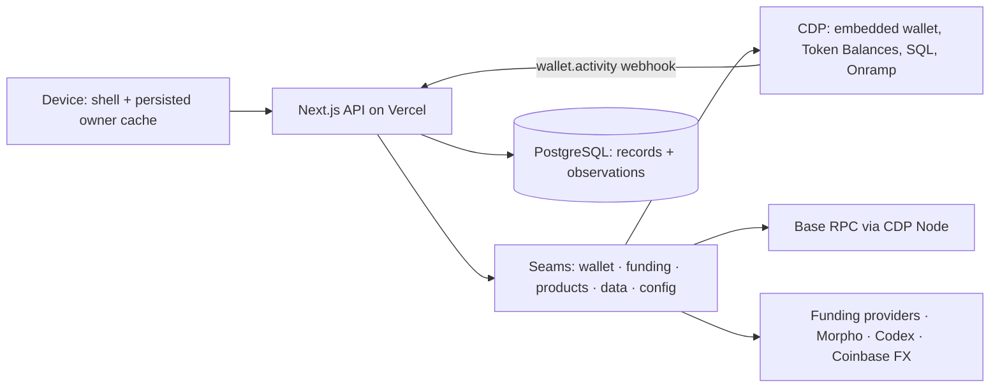

# Architecture

Jesse-locked, September 13, 2026 ([#375](https://github.com/jessepollak/home/issues/375)). The one normative architecture document: where another doc disagrees, this one wins. It states locked direction, not delivery status. Subsystem designs: [actions](actions.md), [balances](balances.md), [Borrow](borrow.md), [funding provider seam](funding-provider-seam.md), [regional money](regional-money.md).

## Thesis

Home is the WordPress for neobanks: a small, stablecoin-native core on Base plus typed compile-time seams that forks fill with their own brand, countries, assets, and providers.

Core financial assets and positions live on Base: accounts are smart accounts; holdings are tokens identified by chain + address with `bigint` amounts; cash is represented by stablecoins shown in their own fiat, never an internal fiat balance; totals are estimates in the user's presentation currency. Fiat custody and payment-rail complexity stay at provider edges — onramps, offramps, and cards, which spend from a stablecoin balance. A stablecoin's denomination does not imply fee-free funding or redemption at par ([regional money](regional-money.md)). The chain is the ledger of record. Home remembers only what it alone knows and what it last saw.

## Principles

1. **Stablecoins in, stablecoins everywhere, stablecoins out.** No fiat balance, fiat ledger, or bank reconciliation in the core. A provider that touches fiat plugs in at an edge and hands the core a token on Base. The funding seam is the template for every edge: manifest + adapter + conformance test, and the core owns the parts that can lose money.
2. **The chain is the truth; Home remembers two things and never confuses them.** A *record* preserves Home-specific intent, association, or commitment that cannot be reconstructed from provider data: a user's confirmed action and the handle and hash linked to it, a funding order and Home's unique claim of the receipt that settled it, or a webhook signing secret that CDP returns only once. An *observation* is replaceable source data at a stated block or time: a balance, a price, a provider's current order status. Observations carry their provenance, may be replicated on the device and the server, and can be dropped; records cannot be reconstructed and may retain observations as evidence. Nothing authorizes a money action from an observation: where calldata depends on chain state (limits, previews, allowances) `prepare` reads it at a pinned block; otherwise the chain's own execution is the check. What is neither record nor observation is not stored: it is signed into a cookie or token, or recomputed.
3. **Small core, typed seams, compile-time plugins.** A provider or product is one directory plus one registration line; a region, currency, or asset is one typed config entry. The core changes only for a new *kind* of thing. No runtime plugin loading.
4. **Fork-first, Vercel-first.** A provider integrator can run the seam they are testing locally with Postgres and Base Account sign-in and no CDP project (`bun run db:up` starts a local PostgreSQL); the full app needs its enabled providers' credentials. Every provider is optional and degrades to "unavailable" with a setup message. Configuration is typed, validated, and versioned; credentials live only in deployment secrets; no upstream telemetry. One deploy target: Vercel plus Marketplace Neon. Migrations run automatically in the production build step and are additive once any shared environment has applied them; before that, the database may be dropped and recreated.
5. **Measured, honest quality.** Performance marks with CI budgets; Playwright smoke on every preview; unavailable is never zero; stale is served as stale with its age; a partial read is labelled partial.

The five money invariants are not derived from these principles; they are the floor no PR crosses: server-authored calldata · verified scope · `bigint` amounts · idempotency key = action id · owner-generation fence.

### The thinness test

Before adding persistence, a route, a poll, a runtime, or a dependency, answer in order. Any question can reject; the order is for classification, not for stopping early.

0. Does a provider already do this? Call it; do not rebuild it.
1. Can the fact be reconstructed from a provider at the granularity you need? Then it is an observation: cache it at its source granularity (a price per asset, a balance per address) with explicit provenance and disposable replicas.
2. Does it change on an event Home can see (own action, webhook)? Invalidate on the event; a TTL is only the backstop for a missed signal.
3. Is there a shipped feature that must act while no user is present? If not, no new runtime — no cron, queue, socket, or indexer.
4. Can an existing shape carry it? Add a field or a stage, not a second contract.

Applied: a second savings-positions endpoint → 4 rejects. Ponder → 0 and 3 reject (CDP SQL and Token Balances already index). SSE → 3 rejects. A per-owner price cache → 1 and 4 reject. An intent ledger → 0 (CDP idempotency) and 4 reject. The balance snapshot row, the CDP webhook route, and the funding tables → admitted. The balance-history change log and shared valuation series → admitted as observations: they are ingested on requests only (the operator check now, history reads from slice 2) and marked dirty by webhooks, with no new runtime (historical balances were accepted as the shipped requirement in #1041).

## Boundaries

```mermaid
flowchart LR
  Device[Device: shell + persisted owner cache] --> API[Next.js API on Vercel]
  API --> Seams[Seams: wallet · funding · products · data · config]
  Seams --> CDP[CDP: embedded wallet, Token Balances, SQL, Onramp]
  Seams --> Base[Base RPC via CDP Node]
  Seams --> Providers[Funding providers · Morpho · Codex · Coinbase FX]
  API --> Postgres[(PostgreSQL: records + observations)]
  CDP -- wallet.activity webhook --> API
```

An optional, replaceable pre-release deployment-access gate runs before these boundaries. Its signed `home-access` cookie is independent of Home customer identity and future administrator authorization; it creates no user, wallet, staff, support, or configuration authority. Public machine routes remain an explicit path allowlist. Administration composes deployment access when enabled, a verified Home session with a non-null Base smart account, then a separate server-only operator allowlist decision. `/admin` pages reverify only the signed native `home-session` cookie; a CDP render hint or any unverifiable Home session cookie is treated as signed-in but forbidden, never operator proof. `/api/admin/*` verifies the native session or CDP bearer token before evaluating the same allowlist. Unset or malformed allowlists deny all; editing the list and redeploying changes operator access without touching customer sessions or data. Authorized administrators change versioned, revision-checked settings in Postgres; each change and each individual customer read enters an append-only audit log. Runtime operator settings take precedence over code defaults for registered domains: the `brand` domain stores display name, description, primary color, and background color, and the `products` domain narrows the offered Save vaults and Borrow markets and switches Save, Borrow, Invest and Send entries without adding or widening an entry. With no stored brand row, it reads defaults from `config/brand.ts` without writing. The server brand resolver falls back to these code defaults when the database is unset, unreadable, or holds an unparseable brand row; it never writes. Brand settings are not yet applied to customer pages; layout, metadata, and the administrator editor await follow-up delivery. The Settings section at `/admin` provides an Invest pane to hide discovery categories and configured assets; without a database it shows a full-catalog notice instead of the pane, and when the database read is unavailable it shows a retry-later notice. Operator console shell navigation and empty-state sections are available at `/admin`, including Settings → Products and markets, together with the Settings fee form and the Money fee revenue view when the settings store and database are available; Account entry and operational data views await their own delivery.

The API validates the session, resolves the one smart account the caller may act for, and invokes a seam. Scope is the verified subject, its smart account, chain 8453, and the declared provider; nothing in a request body or query widens it. It never receives keys or unrestricted signing authority; the user signs in the browser. Private responses are `Cache-Control: private, no-store` with `Referrer-Policy: no-referrer`; document responses keep the browser default referrer policy because a document-wide `no-referrer` sends a null `Origin` on same-origin form posts. Route ownership is expressed by `shared/<feature>/contract*.ts` naming and the handler import, not by file headers. Every `/api` route handler stays dynamic — `export const dynamic = "force-dynamic"`, `export const revalidate = 0`, or a request-time read — because a prerendered handler would answer every caller with one shared static response, and the post-build [repository gates](gates.md#repository-gates) check fails either half.
`apps/web/app/api/route-contracts.json` inventories every route handler under `apps/web/app/`: `routes` classifies `app/api` handlers with a declared shared contract, reasoned exemption, or baselined gap; `appRoutes` classifies handlers outside `app/api` with a reviewed exemption; a handler inside a Next.js private folder (`_`-prefixed directory) is not reachable as a route and is not inventoried. Contract and client-linkage checks are `/api`-scoped, so a handler needing a parsed shared contract belongs under `app/api`. Its baseline records each tolerated route's weak contracts, contract modules without a version token or parser, and existing handler or client linkage gaps as route-to-contract pairs, so a tolerated route cannot newly declare a weak contract or a contract no client parses outside its recorded tolerance; these gaps may only shrink. One baseline entry, `shared/fees/contract.ts`, fixes an omission from when the baseline was introduced, not a new gap: no route declares that module, and its settings travel inside the versioned operator-settings envelope with `fees.schemaVersion: 1`; the rule that these gaps may only shrink stays in force for future gaps. `apps/web/app/api/route-contracts.contract.test.ts` enforces coverage of both sections, handler and route-specific client linkage for API routes, and versioned parsers, and freezes the tolerated route-to-contract pairs, the exemption set, and the routes allowed to carry a client-linkage reason. A route handler that exports more than one method declares its contracts per method, and a deliberately unversioned compatibility method carries a named allowance, so a versioned parser declared for one method cannot cover another. Handler linkage is module-granular: it proves that the route's import closure imports the declared contract module, not that a handler method parses a response through it. The reverse check requires every contract a handler method's implementation references at runtime to be declared for that route, or for that method when methods are classified. Its scan resolves the exported handler's implementation, resolves namespace imports, imported-object member selections, default exports and imported callbacks passed to a wrapper to the imported module's export, follows same-module local helpers, follows imported or member calls only one hop out from the route module (imported calls inside a successfully resolved property-selected handler are not followed), records contract modules named directly by a dynamic import, and does not walk the full server import graph. Existing references are frozen in the `undeclaredHandlerContracts` baseline as route-to-contract pairs — a method-classified route freezes `METHOD contract` identities — and these gaps may only shrink. Client linkage proves that a URL-bearing client module path imports the contract's parser, not that every fetch response flows through it; client URLs are read from literals and templates, so a path composed across variables is not detected. Funding order creation and order-by-id success responses both use `{ version: 1, order }`; network consumers require that envelope version, while cached summaries and the separately versioned open-order, resolution, and cancellation contracts retain their permissive summary reader.
Shared, client, and components contracts parse with `zod/mini` only (`home/no-classic-zod-imports` enforces this); server modules may use classic `zod`.
The funding quote and Activity route contracts use `zod/mini` schemas with derived types, version literals, and parsers shared across route boundaries; the quote route also validates provider output through its parser before signing it, so the handler cannot emit a body outside the contract.

## Core model

| Type | Meaning |
|---|---|
| Asset | chain id + lowercase contract address, or the native discriminator; never a ticker |
| Amount | asset + integer base units; `bigint` in code, decimal-integer strings on the wire |
| Holding | an asset the account holds, with identity and provenance (registry, catalog, wallet), a quantity carrying its source's block or observation time, and a valuation time. Registry quantities share a pinned block; CDP-enumerated quantities do not claim that block |
| Action | a user-initiated onchain operation Home prepared, the user signed, and Home tracks by one id |
| Order | a funding operation at an edge, created against a provider and settled by a verified receipt |
| Presentation currency | the fiat the user reads totals in; changes presentation, never holdings |

Each economic position counts once: vault shares are valued as a position, not again as their underlying; collateral is not liquid cash; a card allocation is not a second holding. Net worth includes collateral and subtracts accrued debt; today's hero is a holdings total, and a net-worth total is a later feature.

## Seams

| Seam | Core owns | Plugin provides | Where |
|---|---|---|---|
| Wallet | session verification, owner fence, one action id | sign-in, signing, `sendCalls`, status lookup | `client/account`, `server/auth` |
| Funding | destination, token identity, one dispatch per order, receipt rule | quotes, KYC fields, payment instructions, provider status | `server/funding/providers/<id>/{manifest,adapter}.ts` |
| Cards (event ingress only) | provider/mode-scoped invalidation identity, dedupe, retention | Immersve JWKS, Bridge PKI and Stripe HMAC verification, event ID normalization, funding-strategy declaration | `server/cards/{provider,store}.ts`, `server/cards/immersve/`, `server/cards/bridge/`, `app/api/cards/webhooks/` ([cards.md](cards.md)) |
| Products | supported assets, shared action issuance, exact or bounded standing approvals, valuation rules | product-specific preparation and reads: vault deposits and withdrawals; market collateral and debt operations; trades | `shared/morpho-markets`, `server/morpho-markets` for the verified isolated-market engine; `server/morpho`, `server/savings`, `server/borrowing`, `server/actions/kinds/trade` for product policy and actions; add a broader protocol adapter only when a second protocol demonstrates the contract |
| Data | the holding shape, pinned registry reads, the valuation math | enumeration (CDP Token Balances), catalog and prices (Codex), FX (Coinbase), history (CDP SQL) | `server/balances`, `server/market-data`, `server/chain`, `server/chain-data` |
| Config | validation, defaults, precedence rules | brand, regions, currencies, asset registries, navigation | `apps/web/config/*`, `shared/assets/base.ts`, `shared/*/config.ts` |

Funding already has the full plugin shape: one provider directory, one registration line, one conformance test (`describeFundingAdapter`); Coinbase Onramp and Ripio sit behind it. Coinbase uses the generic Orders API for quote, one create, and status reconciliation, then renders the allowlisted Embedded Orders payment link in an iframe; production still requires Coinbase enablement and verified domains. Apply that shape to another seam when a real extension demonstrates the contract; configuration entries do not need plugin directories. Shared code changes only when an instruction kind or product kind is new.

## Building blocks

Shared primitives live under `apps/web/` at these owners.

| Block | Owner | Owns |
|---|---|---|
| Server HTTP | `server/http/request.ts`, `server/http/upstream.ts`, `server/http/private-response.ts` | Bounded request reads, deadline-bound upstream requests, and private responses |
| Server auth | `server/cdp/auth.ts` | CDP request JWT signing and typed auth failures |
| Server env | `server/config/env.ts` | Validated environment getters and credential reads |
| Chain hex | `shared/chain/hex.ts` | Validated, lowercase branded addresses and 32-byte hashes |
| Amounts | `shared/amounts/decimal.ts` | Exact decimal/base-unit parsing and formatting, positive amount bounds, and provider decimal reads |
| Process cache | `server/cache/bounded.ts` | Bounded process-local TTL storage and singleflight loads |
| Query factories | `client/query/query-options.ts` | Owner/public query and infinite-query options with scope keys, stale times, and owner persistence metadata |
| Owner boundary | `client/account/owner-keys.ts` | Owner identity keys and session/UI boundary keys |
| Query view state | `client/query/query-view-state.ts` | Query view-state classification, including failures with cached data |

## Data model

Growing-data queries use selective indexed access and bounded work; add appropriate missing indexes with the query and verify the actual plan. [SQL performance](sql-performance.md) defines plan evidence, provider query bounds, justified scan exceptions, and migration rollout requirements.

| Table | Kind | Why it exists |
|---|---|---|
| `customers` | record | the Home person, status, first and last seen times, optional country and invite attribution |
| `invite_codes` | record | one stable invitation code per customer, removed with its owner |
| `customer_credentials` | record | each provider sign-in subject associated with a customer, with optional sourced email |
| `customer_email_requests` | record | one row per Base Account credential holding the asked-at marker, answer and channel, and wallet capability evidence; cascades with the credential |
| `customer_preferences` | record | the customer's single saved configured country code (never `GLOBAL`), distinct from request country, deleted with the customer |
| `customer_wallets` | record | each known chain address controlled by a credential and associated with its customer |
| `operator_events` | record | append-only, idempotent operator lifecycle facts linked to a customer |
| `actions` | record | a confirmed action survives reload and shows in Activity before the indexer catches up; its facts, including the result the chain or wallet reports, are written once and never overwritten, and status is derived from them at read time, never stored ([actions.md](actions.md)) |
| `cashout_orders` | record | one row per cash-out action with its linked provider deposit, whether that link was proven by its transaction receipt, last observed order state, filled, returned and remaining amounts, withdrawability, and settle time; created from the action at confirm or list, linked only after the provider order matches the reviewed amount, platform, currency, and payee (and, when found from the action's transaction receipt, its intent range; an action recorded without a payee hash first derives it from its stored canonical handle through the provider, then can link by matching an unclaimed order from the provider order list when receipt linking is unavailable); deleted with its action by cascade. The provider order is the source of truth; this row caches its last observation and durable end state. |
| `funding_orders` | record | a provider order and its verified receipt ([funding seam](funding-provider-seam.md)) |
| `funding_provider_customers` | record | the durable provider customer identity and hosted-verification state, one row per owner, account provider, provider, and region; created before terms or KYC writes and never reconstructed by scanning orders ([funding seam](funding-provider-seam.md)) |
| `funding_provider_user_tokens` | record | the encrypted provider-issued verification token returned only on a verified create, one row per account provider, owner, provider, region, and sandbox mode, bound to its destination and reused for at most 55 days; stored only as an authenticated envelope and not reconstructible from orders ([secrets at rest](secrets-at-rest.md)) |
| `balance_snapshots` | observation | the last observed holdings and Borrow positions per `(chain_id, address)`, keeping registry block provenance separate from enumeration time; invalidated by Home's own actions and CDP activity webhooks; TTL only as backstop; served as observed, with its age, when a refresh fails ([balances.md](balances.md) §8) |
| `price_observations` | observation | the newest Codex unit price per asset, shared across owners and used within the display freshness bound when a new instance or failed batch has no fresh quote |
| `valuation_attempts` | observation | the newest valuation attempt per asset and its outcome, so a missing, invalid, stale, or unavailable attempt never erases the last-good price observation ([balances.md](balances.md) §3) |
| `history_addresses` | observation | each enrolled wallet's balance-history window start and backward/forward ingest cursors plus a webhook dirty mark; exists only for a `customer_wallets` row and cascades with it ([balances.md](balances.md) §10) |
| `history_assets` | observation | integer identity for each history asset: native ETH, ERC-20 and vault-share contracts, and each Borrow market's collateral and borrow shares |
| `balance_changes` | observation | finalized per-address, per-asset signed quantity changes from indexed transfers, hash-partitioned by address; append-only and rebuildable from CDP SQL, never a current or action quantity |
| `balance_checkpoints` | observation | pinned chain quantities at the window start, reconciliation blocks, and bucket blocks, with the log quantity where one applies; decides each asset's tracking method |
| `chain_buckets` | observation | hourly bucket time → last finalized Base block at or before it, shared across owners |
| `valuation_points` | observation | shared vault-rate, accrued Borrow index, completed price close, and daily FX series by series, basis version, granularity, and bucket, filled on read; hourly rows expire after 8 days |
| `webhook_subscriptions` | record | each app-created CDP subscription and its one-time signing secret, stored only as an authenticated envelope bound to the subscription ID, target, and event type ([secrets at rest](secrets-at-rest.md)) |
| `operator_settings` | record | versioned per-domain administrator values, including the `brand`, `fees`, `regions`, `invest` and `support-assistant` records, with optimistic revisions and the last operator update; the operator allowlist and deployment credentials stay in environment variables, while these values live here with code defaults and the assistant model key is sealed in `support_assistant_credentials` |
| `admin_audit_log` | record | append-only administrator settings changes and individual customer reads, with actor, target, and purpose where required |
| `card_events` | record | verified Immersve/Bridge/Stripe notification identity, `kind` and allowlisted invalidation IDs, scoped by `(provider, mode, event_id)`; no payload bodies; retained 30 days by bounded lazy pruning ([cards.md](cards.md)) |
| `card_accounts` | record | one Bridge customer and Stripe cardholder identity link per Home customer and mode; no KYC or card state; reserved before future enrollment POST ([cards.md](cards.md)) |
| `cards` | record | owner/mode, Stripe card identity and one wallet address per card; no status, PAN or last4; unique Stripe card ID and mode/wallet ([cards.md](cards.md)) |
| `card_transactions` | record | owner-scoped projection of provider-read card authorizations and transactions per card, unique on `(provider, mode, provider_transaction_id)`: minor-unit amount, currency, merchant, status and decline code only, written from fresh provider reads and never from webhook payloads or card numbers; serves Activity after `card_events` pruning ([cards.md](cards.md)) |
| `operator_fee_records` | record | one normalized operator fee per fee-bearing action, written in the action's confirm transaction; it references the action and never copies its transaction hash or result ([operator fees](operator-fees.md)) |
| `support_conversations` | record | one support conversation per customer with its status, handler, unread markers and assistant claim ([support.md](support.md)) |
| `support_messages` | record | customer, operator and assistant messages with author, status, client message ID and the customer message an assistant reply answers ([support.md](support.md)) |
| `support_context_refs` | record | owner-verified funding-order and money-action references attached to a support message ([support.md](support.md)) |
| `support_assistant_runs` | record | one row per claimed assistant reply attempt, including failed and cancelled runs, for the reply budget and replay cap ([support.md](support.md)) |
| `support_assistant_credentials` | record | the operator's model key as an authenticated envelope bound to its provider, with the last four characters for display ([support.md](support.md)) |
| `schema_migrations` | — | makes `bun run db:migrate` idempotent |

Every table appears in this inventory with its kind; `bun run gates` fails if a migration in `server/db/migrations/` or `server/funding/migrations/` creates a table without a row here naming its kind and reason. One shared executor (`server/db/sql.ts`) serves them all. The SIWE challenge remains a signed cookie. `resolveCustomer(session, { create })` maps a verified session to its customer: `create: true` inserts a customer, credential, and known wallet in one transaction, returning existing rows on conflict. Record-writing paths resolve synchronously; sign-in capture runs off the response path unless the request carries a valid invite cookie, in which case the customer write completes before the verified response returns. Reads use `create: false`, and no row means none. Until linking ships, each credential has its own customer. A signed-in customer's country preference is a configured country code stored as a server record, read at render time with a bounded deadline and shared across devices; an anonymous choice remains on the device until one-time adoption at sign-in. `customers.country` is request country, never a device preference. The server never caches prices per owner. Balance history is reconstructible chain and price history, so its tables are observations; what Home displayed or committed to at a time would be a record with its own retention contract.

### Customer registry and operator events

A customer is a person, with status, optional hosting-platform request country (never the device preference), invite attribution, and first and last seen times. Each sign-in method has a separate credential identified by provider and verified subject. The credential owns its sourced email and seen times. Each known smart-account wallet is controlled by its credential and associated with that customer; an address already associated with another credential stays with its first owner. Provisioning CDP sessions can have a credential and customer without a wallet. Until linking ships, each new credential creates its own customer even when two providers report the same wallet. The registry stores no KYC data or raw provider payloads. Sign-ins with a valid invite cookie await the customer write before returning the verified response; other sign-in writes remain deferred and never block the response. Write failures do not fail sign-in. Earliest first-seen and latest last-seen times survive out-of-order delivery. Email and country change only for an input at least as recent as the stored last-seen time or to fill an empty field.

The email is stored lowercase on the credential with its source: `cdp_verified` for the provider-verified email from CDP email sign-in, or `wallet_reported` for an email a wallet reports. A `cdp_verified` email replaces a `wallet_reported` one. A `wallet_reported` email is never used for notifications, recovery, or authentication. Email is never written to events or logs, is deleted with the customer, and is readable only through audited views; this registry ships no email read path, so any future reader must add one. Existing customers get an email at their next sign-in; there is no email backfill.

Invitation landing at `/invite/[code]` retains the first valid touch in a signed, HttpOnly, 30-day `home_invite` cookie when the viewer is signed out; later links do not replace it. Both sign-in handlers consume and clear the cookie after verification. Only a newly inserted sign-in customer receives attribution: the inviter must remain active, must not own the same chain/address wallet, and must not have a credential with the same normalized CDP email. Unknown, inactive, self-invites, activity-created and existing customers receive no attribution. `customers.invite_code` is insert-only; invite codes cannot be updated. A successful attribution writes one idempotent `invite.attributed` event containing `inviteCode` and `inviterCustomerId` in the same transaction as `customer.signed_up`. Invitation links grant no money or account authority.

New `actions`, `funding_orders`, `funding_provider_customers`, and `funding_provider_user_tokens` records carry nullable customer, credential, and (when the address belongs to that credential) wallet IDs for customer-level reads. An idempotent migration backfill and `bun run --cwd apps/web db:backfill-customer-ids` fill existing records without creating registry rows and report unresolved owners. Keep these columns nullable until backfill coverage is verified. They are never used to authorize or scope money and funding queries. Records belong to `customer_id`; money execution remains scoped to the verified credential and the smart account it controls. The money invariants remain unchanged: nothing authorizes a money action from `customer_id`. The customer id stays server-only: never sent to a provider, cookie, token, or client response, and no route accepts a client-supplied customer id for resolution.

Operator events are append-only facts recorded after the response by the server paths that already know them: `customer.signed_up` (row creation), `funding.order_created` and `funding.order_finalized` (received, expired, cancelled, failed, or refunded), `action.confirmed` (first confirm), `verification.changed` (provider customer pending, verified, or rejected), and `invite.attributed` (first valid invitation on new sign-in). Each carries a stable idempotency key, so retries insert once; props hold typed identifiers and amounts, never free text or transaction hashes, and sandbox funding is flagged. Milestones such as funded or first save are derived by query from events and records, not stored. Action results are read from the action record by query, not copied into events. Nothing is sent to upstream telemetry.

Rows are retained for the life of the deployment. `DELETE FROM customers WHERE id=$1` cascades its credentials, emails, wallets, and events; direct event updates, deletes, and truncation are rejected. Owner-keyed `actions` and `funding_orders` remain separate records under their own retention contracts. Automatic backfill runs once when the registry migration applies, deriving customers, credentials, wallets, and events from those records with `first_seen_source = 'backfill'` and approximating signup time by earliest activity. `bun run --cwd apps/web db:backfill-operator` reruns it and inserts only missing rows, which reconciles a live event lost to a failed write; it also recreates a deleted customer from any owner records that were not removed.

## Flows

Every money mutation is one of two flows; reads, authentication, and preferences are supporting operations.

- **Action** (onchain; the user signs): `prepare` → server verifies scope, reads the relevant balances and positions at a pinned block, validates the requested amount, builds calldata with exact per-spend approvals or the bounded card allowance Action, stores the draft → `confirm` → the browser dispatches through the wallet seam with the action id as idempotency key → `handle` records the provider handle and, later, a transaction hash hint → the server records the result once from its own chain or wallet read, and status derives from it. Savings and Borrow read at a pinned block because their calldata depends on it; Send's amount is checked by the chain. Detail and SDK-verified retry semantics: [actions.md](actions.md).
- **Order** (offchain edge; the provider reports): `quote` → `create` → user pays offchain → provider webhook or poll → Home verifies the onchain receipt and marks the order received. Extend Order only for a concrete provider operation. Detail: [funding seam](funding-provider-seam.md).

Balances are a read pipeline, not a flow: enumerate (CDP) ∥ read (pinned registry multicall) → resolve (registry ∪ catalog ∪ wallet) → price → snapshot. Detail: [balances.md](balances.md).

## State changes

Before changing a lifecycle—an action, order, cash-out, identity review, receipt observation, held selection, or cached query—write a state table and include it under Evidence in the PR. List every state and transition. For each transition, state what happens when a read or write is unavailable, fails, times out, or returns partial data; when a second tab or request races it; and when the owner signs out or switches. Mark inapplicable cases explicitly. For each row, name the check that would catch a break: a unit test only when the row falls in a protected [test policy](#test-policy) category, otherwise a Chromium smoke path, a story `play` function, a type or lint rule, or `none`. Unavailable is not zero or empty.

## Client

Two cache layers, one source. The device paints first from a persisted, owner-scoped TanStack cache (every row the server sent, stored whole; cleared on every owner-generation bump; restored entries are trusted only after their scope's contract parser accepts them, otherwise treated as no cache and refetched) — before `session:verified`; only after live SDK/native restore reports a provisional owner and server validation is in flight may owner-fenced balances or country preference be read, never from a render seed alone; the server independently authenticates each GET. Without a matching render seed or device country, the preference read settles the region before the provisional balances read; preference adoption and writes still require server verification. The owner cache and non-authoritative CDP render hint last seven days, aligned with the native Base session; the server answers from the snapshot row and global short-TTL price caches; the chain and providers are the source. The device revalidates after its own confirmed action, on focus, on mount past `staleTime`, with bounded 3 s stale-snapshot convergence, and every 30 foreground seconds (up to ten times) only during a confirmed interruption; the server re-observes on events and the backstop. No layer fabricates a quantity the layer behind it did not produce.

For disposable process-local server observations that need bounded TTL storage and singleflight provider reads, use `server/cache/bounded.ts`. Its entries are shared by every request in the process and never persisted, so it holds public data only; owner-scoped data does not enter it.

One `(shell)` layout stays mounted across client navigation. It owns the session, country preference and request-country reads, account settings, chrome, navigation, and money-flow overlays. Request data is never awaited by its page files: `/home`, `/activity`, `/cash`, `/cash/savings`, `/borrow[/<market>]`, `/investments[/<holding>]`, and `/invest[/<category>|/<assetId>]` render client content inside that layout. `parseShellLocation` and `shellHref` own canonical page route truth; only allowlisted overlay keys are shallow-routed. Money overlays include `flow=send`, `flow=cash-out`, `flow=add-money`, `flow=receive`, `flow=save-deposit`, and `flow=save-withdraw`. Send and Cash out preserve a UUID `action` for prepared review reloads; legacy `flow=send&action=<cash-out id>` resumes and replaces the URL with `flow=cash-out` and the same id. Unknown or wrong-owner reviews drop the action and return to their entry step. Home has separate Send (when offered) and Cash out triggers; Activity cash-out cancellation remains in the Activity detail sheet. Legacy `/save`, `/balances`, and `/fund` redirect to canonical destinations after filtering query intent; `/dashboard` redirects to `/home`. `(shell)/[...shell]` renders the parsed canonical panel for any other non-canonical path, so a direct request such as `/home/nope`, `/cash/savings/extra`, or `/unknown` keeps its URL and never 404s. Invest URLs stay flat, with category and asset detail in the URL. A tap never waits on the network: the server may make the first document load faster, but every later page change is a client transition that paints from the client cache and refreshes in the background. The app runs with Next Cache Components (`cacheComponents: true`). The root layout reads no request data; the `(shell)` layout reads the session seed, country preference and request country inside its own Suspense boundary, so every shell page segment is partially prerendered (◐) and prefetchable, and the owner-scoped query cache paints balances before refresh. `experimental.staleTimes.dynamic = 300` keeps the per-browser router cache entries seeded by a real navigation, including the first document's own page, reusable for five minutes; without it, returning to the first-loaded page refetches its RSC payload on every tap. Because those dynamic payloads carry the session seed, any future client-side sign-in or owner switch must `router.refresh()` (or full-load) so a stale seed cannot outlive the identity change. Routes outside the shell that read request data at the top (`/`, `/access`, `/admin/**`, `/coverage`, `/fund`, the legacy redirects) declare `export const instant = false` and stay request-blocking, so their auth checks, HTTP status and no-JS forms are unchanged; nothing per-user is prerendered or shared across requests. Route segment `dynamic`/`runtime` exports are not allowed under Cache Components and are not used. Next keeps the last few visited routes at each segment level mounted but hidden under React `<Activity>`, which preserves their state and disconnects their effects, so a hidden page runs no queries, polling or timers. `usePathname()` is app-wide and a hidden page still re-renders against the active URL, so each page reads its own location once, when its route entry mounts (`useRouteShellLocation`); every route change except Invest's in-page views is a router navigation to a new entry, and Invest owns its view state after mount. Next development mode may refetch an RSC payload on navigation and warns `instant-unrendered-segment` for shell pages because the session-seed boundary encloses them; the production build is the reference. The authenticated `/admin` tree still forces a server revalidation on every client navigation, so a cached RSC payload cannot outlive an operator-authorization change. A verified sign-in replaces the sign-in entry with a full document load so the shell starts from a fresh per-request seed. Back and Forward own document scroll through one shell-level restoration hook that persists the viewport and first visible feed row in the history entry and restores them on pop; a top-of-page entry with nothing saved is not written, and root pages (`/home`, `/invest`) carry no origin marker, which keeps history writes under WebKit's per-10-second limit during fast tapping. Reselecting the active root tab or the Home mark scrolls the document to the top. The Investments overview stores only its incremental visible-row count in its history entry so a returning deep holding row can mount before focus is restored.

Canonical shell pages export static per-panel metadata. The non-canonical catch-all derives its title from runtime `params`, so its page content explicitly awaits `connection()` inside Suspense. Under Cache Components, runtime reads in `generateMetadata()` (`params`, `searchParams`, `cookies()` or `headers()`) need an intentional runtime content boundary; request reads in the enclosing shell layout alone do not satisfy that validation. This keeps fallback titles route-aware without making canonical pages request-blocking.

One query client, owner-prefixed keys, one owner fence ([actions.md](actions.md#owner-fence)). One row component and one formatting module render every amount; features select from shared snapshots and never re-query what a selector gives them. Send and Save use the snapshot for display maxima, including stale maxima labelled with their age; cached quantities never authorize execution (principle 2). Priced dust and unpriced discovered wallet holdings both render in the owned Investments list ([balances.md](balances.md) §9).

Owner-held panel state resets by remounting under `OwnerBoundary` (`client/account/owner-boundary.tsx`) keyed on `uiBoundary` where panels adopt it (Cash/Save); other owner-held state, such as the mounted trade sheet, resets on the same `uiBoundary` change. This is separate from, and does not replace, the owner query fence or persisted owner cache. New owner identity strings assembled from a subject and another owner part (address, smart account, owner key, provider, chain) belong in `client/account/owner-keys.ts`, which `home/owner-identity-helper` enforces across `app`, `client`, and `components`; the rule catches direct tuple construction rather than every owner-derived string. It follows simple const aliases of owner-named roots and treats an owner-named member reached through a container or parameter (`props.session`) as a root; reassigned bindings, destructured renames, and members whose names do not mark an owner source stay outside the rule.

Each query scope keeps its audience, persistence, stale time, and `mutatedByActions` policy in its own file under `apps/web/client/query/scopes/`; `scopes/index.ts` imports every scope into the composed registry, which `client/query/query-scopes.ts` re-exports. Add a scope by adding its file, importing it in that index, and adding its registry entry. New queries use `ownerQuery` or `publicQuery` (and their infinite variants) from `client/query/query-options.ts`. Non-money POSTs that stale owner scopes declare them with `ownerMutation` `meta.invalidates` in `client/query/mutation-options.ts`, dispatched once by the query client's `MutationCache.onSuccess`; money actions retain `client/query/after-action.ts` convergence. An action-mutated scope must be invalidated after confirmed actions or included in pull-to-refresh; a registry test checks this coverage.

## Quality bar

Presentation work follows the visible surface. Home uses a summary-only presenter with unsorted investment counts; Cash formats only its selected cash rows; Investments formats only its visible rows. No production page builds the grouped portfolio list, and `home/no-full-portfolio-presentation` blocks the full presenters outside tests and stories. A retained hidden page keeps its state without re-running effects, and fetch-status-only changes do not rebuild presented rows. Exact amounts, partial/unavailable states, pending cash-out attribution and owner/region boundaries remain unchanged. See [large-wallet presentation](investments-performance.md) for the presentation tests, CPU measurements and remaining device-validation limits.

Owner-cache persistence subscribes only to relevant owner query changes, coalescing before snapshot construction. Full validated envelopes use IndexedDB with lossless gzip and atomic owner leases; legacy localStorage migrates only after a successful commit, with a storage-denied fallback. A small, owner/region-scoped localStorage Home presentation paints before full restoration and is never an action or holdings source. Boundary notifications clear that display even when no query exists. Sign-out revokes disk leases and cancels queued local work; preserved-owner subscriptions retain their pending work. Full restore is deferred until after first paint and guarded against late owner/memory changes. Storage/diagnostic failure stays best effort. See [balances.md](balances.md#5-one-client-query-persisted-whole) for limits, freshness and migration behavior.

Marks: `shell:paint`, `session:verified`, `balances:painted` (fires on `ready` only), `action:first-interactive`; CI budgets `balances:painted`. Product-phase reporting and known undercount behavior are documented in [performance observability](performance-observability.md). Playwright smoke runs on every preview against a fixture provider. Each subsystem doc lists its unverified assumptions; each is verified once on preview and struck there. Frame budget: never `setState` per pointer move or price tick. UI direction ([AGENTS.md](../AGENTS.md)): direct and minimal; one row component and one formatting module; actionable review facts on confirm screens only; disclosures live under Account.

## Dependencies

`apps/web/package.json` states the compatibility Home accepts; `bun.lock` is the pin. Installs run `bun install --frozen-lockfile`, so the lockfile — not the manifest spec — decides the version that runs, and a version in the manifest is never a reason to work around an upgrade. The Bun toolchain pin in `packageManager` is separate and stays.

- **Ranges by default.** A direct dependency declares a caret range (`^x.y.z`) unless it is in the deliberate set or carries a `patchedDependencies` entry. A patch key is version-exact: its package stays exact, and bumping it updates the patch in the same PR.
- **The deliberate set.** `next`, `react`, `react-dom`, the wallet and CDP SDKs (`@base-org/account`, `@coinbase/cdp-core`, `@coinbase/cdp-hooks`, `@coinbase/cdp-sdk`), chain and money-movement libraries (`viem`, `@zkp2p/cash`, `@zkp2p/sdk`, `@stripe/stripe-js`), persistence and contract parsing (`pg`, `zod`), and the root `agent-browser` verification pin stay exact. An exact version means "upgrade deliberately" — one package or one coherent group per PR, release notes reviewed, `bun check` and the affected verification rungs green — never "do not upgrade".
- **A change that needs a newer version raises it in that PR and fixes fallout.** Work around a version only when the upgrade itself is blocked, and name the blocker in the PR.
- **Updates.** [`.github/dependabot.yml`](../.github/dependabot.yml) proposes weekly grouped minor and patch updates: one dev-tooling group and one non-deliberate runtime group, at most two open update PRs, reviewed like any other change. Major upgrades and the deliberate set are deliberate PRs, owned by the change that needs them (or a dedicated `chore(deps)` PR when none does). The ignore rules restrict version updates only, so a security advisory still opens a Dependabot security update for every dependency, the deliberate set included. A grouped update is a mechanical change under [work sizing](work-sizing.md): it lands on its own and never carries feature work.

## Fork and contribution contract

Catalog in code, selection in settings. A fork changes `apps/web/config/*`, public assets, and plugins under the seams — never the core. Code holds the verified catalog: providers and their bindings, regions, and assets. Operator settings on the typed settings store only narrow that catalog, one domain at a time; they never add entries. For money in and out, credentials in the environment mean a corridor is *connected*, and the operator's saved setting means it is *offered* ([operator checklist](operator-checklist.md#money-in-and-out)). A saved settings row wins; with no row, behaviour is derived from the environment and code without writing anything. Settings gate new entries only; exits and in-flight orders never read them. A fork provisions its own Vercel project, Neon database, and accounts for the providers it enables (CDP is optional); it never points at another operator's database or provider project. Upgrades flow through typed config validation and additive migrations. Contributions land as one directory per plugin with its README and conformance test. Process: [operating manual](operating-manual.md).

For Save vaults and Borrow markets, the verified catalog stays in code; operator product settings select a narrower offering at runtime. Settings cannot add, widen, or reconfigure a catalog entry.

## Non-goals

A fiat or card ledger, KYC document storage, custom contracts, multichain routing, runtime plugin loading, a second UI kit or action framework, a money-action state machine, an intent ledger, a `plan_hash`. No additional runtime — cron, queue, socket, indexer — without a shipped requirement that requests and provider webhooks cannot meet.

## Failure modes we accept

- Provider outage: the provider's error is shown; balances show the last observation marked stale with its age.
- Missed webhook: an active client sees an external transfer within the 120 s backstop plus CDP index lag; an idle client sees it on return.
- Action failure modes: [actions.md](actions.md#failure-modes-we-accept).
- Database query timeout: `timeoutMs` on the shared executor (`server/db/sql.ts`) bounds the whole operation, from pool acquisition through `COMMIT`, and cancels it by destroying that connection; a timed-out statement is ambiguous, so `timeoutMs` stays a read deadline and writers use `transaction()`, except the CDP webhook's best-effort markDirty invalidation, whose idempotent, monotonic UPDATE is safe either way: losing the mark only defers that address's re-read until a later webhook or ingest run.
- Pool at suspension: each pool the server opens is attached to the platform lifecycle hook, which keeps the instance alive for one idle interval (the pool's 30-second timeout plus 100 ms, bounded by the remaining invocation deadline) after the most recent client release; the hook holds one idle wait per instance, so a later pool's attach supersedes an earlier pool's pending wait, whose idle connections then die with the instance — the same as running without the hook.

## Comment policy

The enforced scope is non-test, non-story source under the five product layers: JS-family source (JS, JSX, MJS, CJS, TS, TSX, MTS, CTS) through Oxlint's `home/no-comments` rule, and CSS and Python through `scripts/gates/css-comments.mjs` in `bun run gates`, across `app`, `client`, `components`, `server`, and `shared`. The only exceptions are `oxlint-disable*` directives with a `-- reason`, triple-slash references, one-line `/** @public <reason> */` JSDoc on an export, third-party licence or notice headers, and Python functional lines — a line-1 shebang, a line-1/2 encoding declaration, and inline `# type:` or `# noqa` pragmas; the CSS gate allows only a notice header. When prose exposes useful information, either delete it because the code is already clear, assert the behavior in a test, encode the invariant in an assertion or type, enforce the pattern with lint, or move durable operational and architectural context into `docs/`. Applied SQL migrations are excluded by design because migration immutability wins over this source policy.

## Test policy

Unit tests protect money and auth correctness only: money math (amount parsing, formatting, decimals, fees, slippage); calldata and transaction construction (exact and bounded approvals, amounts, recipients); auth scope, sessions, the owner fence and webhook signatures; action lifecycle, idempotency and duplicate-submission protection; shared route contract parsers; money-path provider failures; and PostgreSQL integrity of money and action records. Repository gates that run as tests, such as the route-contract inventory, also stay. Do not add unit tests for rendering, copy, layout, presenters, navigation, query and cache plumbing, operator tooling or configuration registries; observe that behavior through Playwright smoke, stories, types and lint, or leave it untested. Prefer deleting a low-value test over adding one.

Never re-test CDP, Base Account, Next, motion, or happy-dom. No real sleeps or wall-clock reads; no assertions on source text or rendered CSS classes; expectations state a literal or an independently derived value instead of a constant imported from the module under test; integration fixtures load migrations only through `apps/web/tests/helpers/migrations.ts`; matrices are table-driven and bounded; one behavior per test. The test-only Oxlint overrides and temporary-mirror canaries enforce the mechanical rules.
Computed-style reads belong in Playwright, not component tests or stories; `home/no-computed-style-in-component-tests` enforces this.

### Choose the case, then the layer

For each money-path external read or write a change adds or touches, test a rejection, timeout, or malformed or partial result. Assert unavailable, pending, or retained state as appropriate, never a fabricated zero, empty, or success state. For each new or changed money or auth API route, pass the handler's real response through the shared contract parser used by the client. Test each behavior at the lowest layer that can observe it, and only when it falls in a protected category above.
