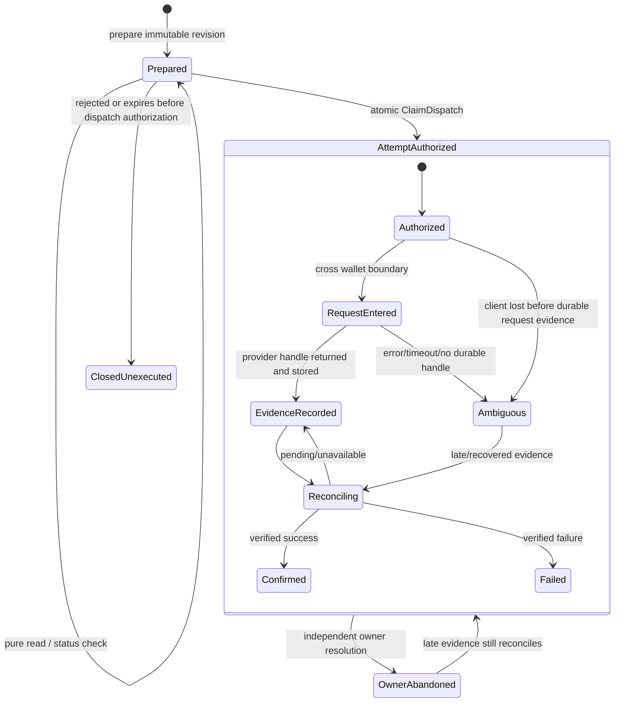
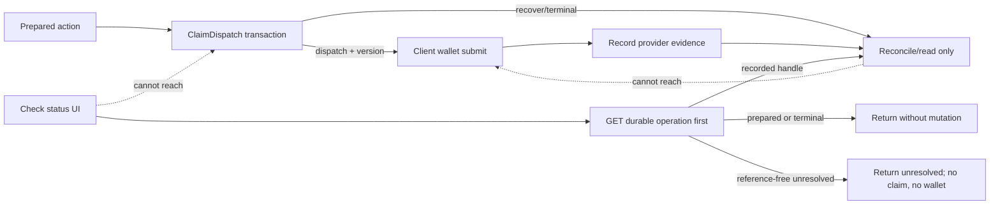

# Attempt-aware onchain transactions

Status: **approved direction, Phase 1 in tree, Phase 2 §3 command contracts locked**. This document is specific to Home's current MoneyAction flow in `apps/web`; it is not a proposal for a general event-sourcing platform.

Phase 2 §3 TypeScript commands live in [`apps/web/server/money-actions/attempt-commands.ts`](../apps/web/server/money-actions/attempt-commands.ts) (`ATTEMPT_COMMAND_CONTRACT_VERSION = 1`). Soft Pass inputs: [#175](https://github.com/jessepollak/home/issues/175) (CDP) and [#176](https://github.com/jessepollak/home/issues/176) (EIP-5792). Contract issue: [#181](https://github.com/jessepollak/home/issues/181). No additive attempt schema in this slice.

## Decision

Keep the noncustodial boundary:

> server prepare → atomic dispatch claim → client wallet submission → durable provider evidence → verified reconciliation

Make that boundary attempt-aware. The immutable reviewed action, permission to dispatch, a particular wallet execution attempt, provider evidence, reconciliation, and admission blocking are different facts and must stop sharing one overloaded status.

The compatibility implementation does not change the store schema. It adds a pure client `checkMoneyAction(action)` path, routes user-visible status checks through it, moves send capability and fresh-balance preflight before the first claim when the durable row is still `prepared`, and synchronously journals a provider-returned handle before evidence upload. The versioned browser journal retries only the exact owner/action/provider-bound handle through the owner-scoped submission route; it never authorizes wallet replay. Unacknowledged entries survive sign-out and account switches because they are best-effort sensitive execution metadata rather than presentation cache; purging them would recreate evidence loss. Cross-tab persistent insertion is serialized with Web Locks; without a safe browser lock primitive, the handle remains memory-only and exact upload still proceeds. Later slices add durable attempts and typed atomic commands under a single persistence owner.

## Non-goals

- **No database-and-wallet atomicity.** A browser wallet request cannot participate in Home's SQLite/Postgres transaction.
- **No rollback after ambiguous dispatch.** Once a wallet request may have begun, a missing reference is not evidence that nothing was submitted.
- **No naïve terminal expiry.** Elapsed time must not make late transaction, user-operation, or provider evidence unattachable.
- No generic workflow engine, event store, saga framework, or provider-neutral `execute(anything)` API.
- No server custody, private-key handling, background signing, or automatic compensating transfer.
- No implementation of terminal `unknown → expired` behavior. Owner abandonment/admission release is the #110 / PR #134 store contract (`abandonedAt` plus explicit admission-release).
- Phase 1 of #131 did not edit the store. #134 adds the bounded admission-release field and command on Memory/SQLite/Postgres without a blanket `unknown → expired` transition.

## Current boundary and failure windows

Today a `PreparedMoneyAction` binds the verified owner tuple, reviewed calls, amounts, warnings, expiry, and `reviewHash`. `POST /api/actions/:id/claim` atomically changes a prepared row to `submitting`; only the returned `dispatch` disposition permits the client to call a wallet. Submission evidence is then uploaded through the submission endpoint and verified receipts drive confirmation.

That prevents two tabs from both receiving first-dispatch permission, but one operation row still represents too many independent facts. In particular, `submitting` without a reference can mean either “the client never reached the wallet” or “the provider accepted a request and Home lost the response.” Persistence cannot infer which one occurred from status and time alone.

### Failure-window matrix

“Definitely not submitted” below means Home can establish that the wallet submission API was not invoked in that trace. It does not mean an unrelated external transaction is impossible.

| Window | Durable observation | Classification | Safe behavior now | Attempt-aware target |
|---|---|---|---|---|
| Prepare validation, simulation, or persistence fails | No issued action, or no usable prepared response | **Definitely not submitted** | Show preparation failure; wallet untouched | Idempotently retry preparation by intent key |
| Pure status GET fails | Existing row unchanged | **Definitely not submitted by the check** | Keep durable row visible; retry the read | Record bounded reconciliation failure/next-check time, not a dispatch attempt |
| Provider capability check fails before claim | Row remains `prepared` | **Definitely not submitted** | Do not claim; report unavailable/stale session | Keep as pre-dispatch validation evidence only |
| Fresh portfolio/balance check fails before claim | Row remains `prepared` | **Definitely not submitted** | Do not claim; require a new valid review/attempt as policy dictates | Record validation result separately from execution attempt |
| Claim loses its compare-and-swap, owner mismatches, or action is already terminal | Existing durable state wins | **Definitely not submitted by this invocation** | Read/recover only; never call wallet | Typed claim returns `recover`, `terminal`, or conflict without dispatch authorization |
| Claim commits; client stops before entering wallet call | Reference-free `submitting` | Locally **definitely not submitted**, but durable row alone cannot prove it | Keep fail-closed; do not generically roll back | Attempt has dispatch authorization plus a durable phase that distinguishes authorized from request-entered where the client can report it |
| Wallet rejects before accepting (for example an explicit user rejection) | Claimed row, usually no provider reference | **Definitely not submitted only when provider semantics make rejection definitive** | Record `rejected`; never infer this from generic transport errors | Store normalized provider evidence with provenance and certainty |
| Wallet request throws, times out, disconnects, or page unloads after invocation begins | Claimed row, no reference | **Possibly submitted / ambiguous** | Mark unresolved; never replay with a new execution identity | Reconcile by provider request key, account activity, nonce/user-op data, or explicit owner resolution |
| Provider accepts request but response is lost | Claimed row, no reference | **Possibly submitted / ambiguous** | Keep admission blocked; do not roll back to prepared | Provider-recoverable request identity is attached to the attempt before or during dispatch where the provider contract permits |
| `wallet_sendCalls` returns an ID, then an unrelated account-state recheck throws | Claimed row may remain reference-free even though client briefly had a handle | **Possibly submitted; avoidable evidence loss** | Phase 1 returns/parses the ID first, then uploads it under the already-authorized owner | Evidence capture is the immediate next command after provider return |
| Provider returns a user-op hash/submission ID, but evidence upload fails | Provider reference is retained in the versioned browser journal | **Possibly submitted** | Retry only the identical handle after an owner-fenced durable GET; exact durable evidence acknowledges and removes only that journal entry. Never resubmit to the wallet. | Move the same evidence contract onto the durable attempt record. |
| Evidence is durable but receipt/status lookup is unavailable | Recorded handle, unresolved status | **Possibly submitted, now recoverable** | Poll only the recorded reference | Reconciliation command advances monotonically from verified evidence |
| Receipt/provider result is observed, but final database write fails | Strong provider evidence, stale Home status | Execution result known to the observer; durable projection stale | Re-run verified reconciliation idempotently | Persist provider observation and projection update atomically where possible |
| Owner releases admission while execution remains ambiguous | Admission unblocked, attempt still unresolved | **Possibly submitted** | Must not assert onchain non-submission | Store abandonment/admission release independently; accept late evidence forever within retention policy |

Phase 1 deliberately reduces the first two avoidable claim windows: status checks no longer claim, and send capability plus fresh balance validation happen before claim when a durable GET establishes that the row is still prepared. Expiry and account fencing are still rechecked immediately before wallet dispatch using the canonical server-returned action.

## Target concepts

### Immutable action / intent

The action is the owner-bound thing the user reviewed. It contains the intent identity, immutable revision, exact normalized calls or sensitive call digests, amounts, warnings, policy/configuration binding, `reviewHash`, and expiry. A changed plan is a new reviewed revision, never an in-place mutation of an authorized payload.

Home may eventually distinguish a stable intent ID from action revision ID, but the current `PreparedMoneyAction.id` remains the compatibility identity during migration.

### Execution attempt

An attempt is one effort to execute one immutable action revision. It has its own ID, sequence number, provider, account, creation time, dispatch phase/version, provider request key, evidence set, reconciliation state, and owner-resolution state.

An attempt does not imply that a provider was called. Conversely, an ambiguous attempt is never converted back into “no attempt.” A later attempt is allowed only by explicit action/provider policy after the earlier attempt is resolved or admission is consciously released.

### Dispatch authorization phase and version

The atomic claim grants first-dispatch permission to exactly one attempt. Model it as a versioned phase, not as a broad operation status:

- `unclaimed`: no attempt may invoke a wallet.
- `authorized(v)`: attempt `A` owns dispatch authorization version `v`.
- `request-entered(v)`: the client reports it is crossing the wallet invocation boundary. This improves diagnostics but cannot be made perfectly atomic with the provider call.
- `evidence-recorded(v)`: at least one provider reference is durable.
- `closed(v)`: reconciliation or explicit policy closed dispatch for that attempt.

Only an atomic `ClaimDispatch` command can produce `authorized(v)`. Reads, checks, reconciliation, owner abandonment, and UI refreshes can never produce dispatch authorization.

### Provider evidence

Evidence is append-only, typed, provenance-bearing data:

- transaction hash;
- ERC-4337 user-operation hash;
- Base `wallet_sendCalls` submission ID;
- provider status observation tied to one of those references;
- verified receipt/call match, block data, success, and confirmation policy result.

Evidence recording is idempotent. Repeating the same fact succeeds; a conflicting transaction hash or handle for the same evidence slot fails closed. Provider-status payloads are observations of an immutable handle, so the same handle may advance monotonically (for example `pending` → `confirmed`) without changing its identity. Opaque provider submission IDs compare exactly and case-sensitively; chain hashes use their canonical hexadecimal comparison. Client reports are leads until the server verifies owner, chain, sender, calls/effects, and provider relationship.

### Reconciliation

Reconciliation reads only existing attempt evidence or a provider-supported stable request key. It does not claim and cannot invoke a wallet submission API. It may append stronger evidence and advance the projected result monotonically. Weak or out-of-order observations cannot overwrite stronger verified facts. When several recorded references are available, a transaction hash is preferred over a user-operation hash or provider submission handle.

### Owner abandonment and admission release

Owner abandonment means “the owner no longer wants this unresolved attempt to block a new Home flow.” Admission release is a product-policy result used by the send gate. Neither means “the transaction did not happen,” “the provider dropped it,” or “funds are safe to spend twice.”

Store these independently from reconciliation:

```ts
type OwnerResolution =
  | { kind: "active" }
  | { kind: "abandoned"; at: string; reason: "owner-request" | "policy-timeout" };

type Admission =
  | { state: "blocking" }
  | { state: "released"; at: string; policyVersion: string };
```

Late evidence remains attachable after abandonment or admission release. If it proves execution, Home reconciles and surfaces the result; admission policy then decides how to warn about or constrain any newer attempt.

## Typed command and API direction

Keep feature-specific prepare endpoints. Do not add a generic browser-authored calls endpoint. The kernel exposes versioned commands in `attempt-commands.ts` (`ClaimDispatch`, `RecordProviderEvidence`, `ReconcileAttempt`, `ReleaseAdmission`). Phase 3 persists them; this slice only locks the types.

Locked answers that the types encode:

- `providerRequestKey` is Home correlation (`action.id` as CDP idempotency header or EIP-5792 request `id`). It is not a GET locator and not provider evidence.
- Only `ClaimDispatch` with `disposition: "dispatch"` grants first wallet send. Recover / reconcile / admission-release never do.
- Provider evidence starts at provider return (or a later status lookup that actually finds a handle). No preallocated `submissionId`.
- `ReconcileAttempt` is read-only. Missing evidence after invoke-then-throw is `ambiguous`, not `not-submitted`.
- `ReleaseAdmission` is independent of execution. Ordinary recover must not write `unknown → expired` (#110 / #134).
- Same provider key + different payload fails closed where the provider reports it (`idempotency_error`, `5720`). Untested live replay stays `unknown`. Never invent recovery.

Likely HTTP projection, retaining current routes during migration:

- `POST /api/actions/:id/claim` → typed `ClaimDispatch` compatibility route.
- `GET /api/actions/:id` → pure durable read plus bounded server reconciliation of already-recorded transaction hashes.
- `POST /api/actions/:id/attempts/:attemptId/evidence` → idempotent evidence append.
- `POST /api/actions/:id/attempts/:attemptId/reconcile` or an authenticated GET/check projection → no dispatch capability.
- `POST /api/actions/:id/attempts/:attemptId/admission-release` → explicit owner/policy command, never a generic status write.

The browser `checkMoneyAction(action)` implemented in Phase 1 is the client contract precursor: it performs an owner-fenced GET first and only calls receipt/provider status helpers when the returned durable row already contains a transaction hash, user-operation hash, or Base submission ID.

## State diagrams

### Action and attempt



### Dispatch authority versus status checking



## Invariants

1. Only a successful atomic claim with `disposition: dispatch` grants first wallet dispatch.
2. `checkMoneyAction`, durable reads, reconciliation, refresh, and remount never call claim or wallet submission APIs.
3. Every action, attempt, evidence write, and admission command is scoped to the verified tuple: subject, account address, Base chain ID, and account provider.
4. The client submits only the canonical server-returned action after claim. Reviewed-plan comparison remains exact, including sensitive call digests.
5. A provider request occurs outside the database transaction. Home does not promise exactly-once execution across browser, provider, and chain boundaries.
6. Missing evidence is not negative evidence after a wallet request may have begun.
7. Evidence is immutable/idempotent; conflicting references fail closed and are auditable.
8. Confirmation requires server-verified receipt/provider facts and expected sender/calls/effects. A client success response is not confirmation.
9. Ambiguous attempts are never generically rolled back to prepared and replayed with a new execution identity.
10. Admission release and owner abandonment do not terminalize reconciliation and do not block late evidence.
11. Fresh spendability checks happen before first claim where they can establish non-submission, then expiry and owner/account fencing are checked again immediately before dispatch.
12. Account switching invalidates in-flight client work before claim, provider polling, or evidence mutation can cross owners.
13. No SQL transaction remains open during provider calls.
14. Legacy rows with reference-free claimed states migrate as potentially dispatched, never as safe-to-retry.

## Provider-specific facts and unknowns

These are facts demonstrated by Home's pinned client interfaces and tests, not broader guarantees beyond those interfaces.

### CDP embedded wallet

Current code facts:

- `sendUserOperation` accepts Home's action ID as `idempotencyKey` and returns a user-operation hash.
- `getUserOperation` can be queried by user-operation hash, smart account, and Base network.
- Home compares returned provider calls to the reviewed calls and verifies the resulting transaction receipt with the expected sender/user-operation relationship.
- Once a user-operation hash is durable, status checks can reconcile without calling `sendUserOperation` again.

Soft Pass (#175), locked into `attempt-commands.ts`:

- Do not authorize a new send after `sendUserOperation` has been invoked and thrown.
- Do not implement GET-by-idempotency-key recovery. Official GET is by `userOpHash` only; live unfunded GETs by key were 404.
- Same-key replay returning the original hash is a **docs claim**, not a tested recovery API. `walletSecretId` in the body is an untested fingerprint risk.
- `idempotency_error` / `already_exists` do not grant a new execution identity and do not prove non-submission of the first attempt.
- Passing `X-Idempotency-Key` is wiring, not recovery proof.

### Base Account

Current code facts:

- Home requests `wallet_sendCalls` version `2.0.0` on Base, with `atomicRequired: true`, the verified universal account as `from`, and the Home action ID as request `id`.
- The provider returns an opaque submission ID, which `wallet_getCallsStatus` accepts later.
- Home requires matching submission ID, Base chain, atomic execution, and a single consistent receipt transaction hash.
- Phase 1 preserves the returned ID before any post-request account-state recheck. Pre-dispatch account/chain checks remain in place.

Soft Pass (#176), locked into `attempt-commands.ts`:

- Home request `id` is correlation / uniqueness, not CDP-style idempotent replay. Do not treat the action UUID as a replay key.
- Action UUID ≠ provider evidence. Do not persist it as `submissionId` before `wallet_sendCalls` returns.
- Lost return is reference-free `unknown`. Home never looks up `getCallsStatus(actionId)`. Coinbase status RPC rejected Home UUIDs (`-32602`).
- Definitive `not-submitted` on this invocation: pre-dispatch throw, or provider `4001` user reject. After `wallet_sendCalls` is entered, the outcome is `ambiguous` unless a later handle/receipt is verified.
- `5720` is prior-submission / fail-closed, not `rejected`. `5730` / `4200` / `-32602` are lookup failure, not non-submission.
- Live Base popup `5720` / `4001` / retention remain **unknown**. Do not invent them.

`atomicRequired` describes atomicity of the call bundle as executed by the wallet; it does not make the database claim and wallet request atomic.

## Migration compatibility

The attempt schema should be additive and support a rolling deployment:

1. Add action revision, attempt, evidence, reconciliation, and admission fields/tables without changing current route behavior.
2. Backfill each legacy row deterministically:
   - `prepared` → immutable action revision, no attempt;
   - claimed row with any reference → attempt 1 with authorization plus typed evidence;
   - claimed reference-free `submitting`/`unknown` → attempt 1 marked ambiguous, admission state copied from existing policy;
   - terminal row → action plus attempt/result when dispatch occurred, preserving original timestamps and status.
3. Never backfill a reference-free claimed row as unsubmitted, rolled back, or newly prepared.
4. Continue accepting legacy evidence endpoints while translating them into `RecordProviderEvidence` commands. Dual-read the new projection first, then the legacy row during rollout; avoid dual writers with independent conflict rules.
5. Keep legacy action IDs as public IDs. Generate deterministic attempt IDs for backfill or store an explicit legacy mapping.
6. Make evidence uniqueness owner/provider-aware and preserve the existing verified execution uniqueness contract.
7. Cut stores over together: Memory, SQLite, and Postgres must pass one parameterized contract before runtime selection changes.
8. Remove legacy status mutation only after all clients use typed commands and rollback has been rehearsed against a database snapshot.

## Fault-injection and real-store test strategy

### Client/component faults

Inject a failure or account change at every await boundary:

- durable GET before any claim;
- capability and fresh portfolio preflight;
- claim response;
- immediately before wallet invocation;
- provider request accepted/response lost;
- provider handle returned/evidence upload fails;
- evidence stored/receipt polling unavailable;
- owner/account changes during read, preflight, dispatch, polling, and evidence recording;
- remount with prepared, reference-free ambiguous, user-op-hash, submission-ID, and transaction-hash rows.

Assertions must count calls, not rely only on UI copy: prepared and reference-free checks make zero claim calls and zero wallet submission calls; recovery polls only stored handles; preflight failure occurs before claim; Base handle capture survives the removed post-request recheck.

### Store contracts

For each of Memory, SQLite, and Postgres:

- concurrent claim grants one dispatch authorization/version;
- repeated claim returns the same attempt as recover;
- same evidence is idempotent; conflicting evidence is rejected;
- owner/provider/address/chain isolation applies to read, claim, evidence, reconcile, and admission release;
- out-of-order reconciliation cannot overwrite stronger evidence;
- admission release does not prevent late evidence or confirmation;
- migration fixtures preserve reference-free claimed rows as ambiguous;
- process restart/remount retains attempts and evidence.

Use temporary real SQLite files and the repository's real Postgres contract harness. Keep funded/live-provider tests opt-in and out of CI. Provider contract spikes should use documented sandboxes or controlled unfunded requests where possible; no replay guarantee is accepted from mocks alone.

## Staged implementation plan

### Phase 1 — pure checks and avoidable window reduction (this slice)

- Add `AccountWalletClient.checkMoneyAction`.
- GET the durable operation first; return prepared/terminal/reference-free unresolved rows without claim or dispatch.
- Reconcile only recorded transaction hashes, embedded user-operation hashes, and Base submission IDs.
- Route Home/Recent MoneyActions and Send recovery “Check status” through the pure method; keep fresh confirmation on `executeMoneyAction`.
- Read the durable row before execution. If it is still prepared, check send provider capability and a fresh exact-integer portfolio balance before claim.
- Keep canonical claim response, expiry check, account fencing, and reviewed-call comparison at dispatch.
- Parse/return a Base `wallet_sendCalls` ID immediately after provider return.
- Add focused fault-injection tests.
- Compatibility follow-up delivered: retain a returned provider handle across an initial submission POST failure and retry the identical evidence after an owner-fenced GET. Opaque Base IDs remain byte-for-byte case-sensitive; hash references are canonicalized.

### Phase 2 — provider contract spikes and command types

- CDP and Base matrices: [#175](https://github.com/jessepollak/home/issues/175), [#176](https://github.com/jessepollak/home/issues/176). Soft Pass locked; draft fixtures #178 / #179 stay draft until scoped.
- Versioned commands: `attempt-commands.ts` v1 (#181). `not-submitted` vs `ambiguous` is typed; do not infer from generic error strings.
- Implementation tickets are enumerated on the module as `ATTEMPT_IMPLEMENTATION_TICKETS` for the #159 §4 split. Coord #110 / #134.

### Phase 3 — additive attempt persistence

- Under one store owner, add action revisions, attempts, evidence, reconciliation, and admission fields/tables.
- Implement atomic typed commands in Memory, SQLite, and Postgres together.
- Backfill and dual-read legacy rows as described above.
- Keep current client routes as compatibility projections until all callers migrate.

### Phase 4 — owner abandonment and admission release

- Coordinate with issue #110's immediate user-unblock policy.
- Bounded store/API (PR #134): `abandonedAt` plus owner-scoped `POST /api/actions/:id/admission-release`. Recover/Check status does not write `unknown → expired`. Late evidence and reconciliation stay open. Send-dialog UI language remains a Hugo follow-up.
- Preserve late evidence attachment, warning/reconciliation behavior, and cross-attempt conflict checks.
- Do not implement a blanket `unknown → expired` status transition.

### Phase 5 — verified reconciliation operations

- Add bounded request/webhook reconciliation using the same typed command.
- Persist observations, backoff/last-check metadata, and monotonic projections.
- Add operational diagnostics for reference-free ambiguous attempts, evidence-upload retries, and released admissions that later confirm.

Each phase should be an issue-sized PR with a single kernel writer, focused tests, `bun check`, and independent money-safety review.

## Relationship of #110, #131, and #132

- **#110 is the immediate user-unblock/admission lane.** It governs how an owner can stop an unresolved send from permanently blocking new Home sends. Its result must be expressed as abandonment/admission release, not proof that an ambiguous onchain execution cannot complete.
- **#131 is the transaction-architecture lane.** It reduces reference-free claims and introduces the durable attempt/evidence/reconciliation contract so ambiguity becomes observable and recoverable rather than overloaded into one operation status.
- **#132 is a duplicate of #131.** Design and implementation decisions belong on #131 so there is one architecture source of truth.

The sequencing is complementary: Phase 1 of #131 can land without store changes; #110 may supply the bounded admission-release policy; later #131 store work incorporates that policy into the attempt-aware model. Neither issue should weaken the atomic first-dispatch claim or treat a missing handle as permission to resubmit.
