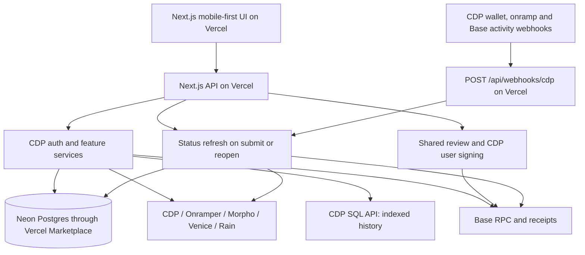

# Home — target production architecture

Status: **target / not the current tree.** This is the 2026-09-07 production-destination design (Vercel + Neon Postgres + CDP webhooks, later `packages/*`). It is not a map of `apps/web/` today and not a delivery inventory.

**Current tree (read these first):** [build status](build-status.md) · [wallet runtime spike](wallet-runtime-spike.md) · [Vercel deploy](vercel-deploy.md) (bun settings; Neon money-action adapter is in the tree when `DATABASE_URL` is set) · [architecture review](architecture-review-2026-09.md) · [docs index](README.md)

Formerly published as `docs/technical-design.md`. Historical two-hour slice plan: [archived implementation plan](archive/implementation-plan-2026-09-07.md). Product intent: [product scope](product-scope.md).
Updated: 2026-09-08 (relocated and retitled; body is the 2026-09-07 design).

## Recommendation

Build Home as one modular application in one repository, deployed through Vercel: Next.js web/API, Neon Postgres provisioned through the Vercel Marketplace, and CDP webhooks with request-driven transaction status checks. Keep shared domain types, typed configuration, and explicit provider adapters. Make the fork experience a first-class product: clone, explore a credential-free fixture preview, change the brand and regions, provision personal provider projects, then deploy a real app.

Use Next.js, TypeScript and Tailwind, prioritizing mobile layouts while making desktop work responsively. Use CDP user wallets, Coinbase Onramp and CDP Trade API as the initial integrations, with Morpho for saving and later borrowing. Keep SDK objects out of feature components and business rules. Include PostgreSQL persistence and reconciliation in the initial live build. CDP SQL API supplies indexed Base history, with CDP balance APIs/RPC for current state and receipts. No self-hosted Ponder is needed for the initial feature set. All customer signing stays in the user-wallet flow.

Today’s intended outcome is a live deployed app with email sign-in, persistent user state, a real Base money action and recoverable activity. Build and demo locally first; deploy to Vercel in the final release step. Additional financial features follow as time permits. Use Next.js + Marketplace Postgres + CDP SQL API + CDP webhooks, with status checks on submission/reopen as a fallback. Do not introduce another host or make Ponder a prerequisite.

## Decisions and tradeoffs

| Decision | Recommendation | Strongest alternative / cost |
|---|---|---|
| Web or native | Mobile-first web now; shared domain and integration contracts for native later | Expo improves device integration and native feel; adds distribution and a second UI surface |
| Application shape | One modular app/repository deployed through Vercel | Additional runtimes increase setup and operations |
| Extension model | Compile-time modules and typed adapters | Runtime plugins enable third-party installation but expand the trust surface and compatibility burden |
| Wallet | CDP user wallets first, narrow auth/signer boundary | Direct SDK use everywhere is faster initially; changing providers then affects every feature |
| Database/backend | Neon Postgres through Vercel Marketplace + Drizzle; CDP SQL for history and RPC for state | Ponder remains useful for custom indexing, but its continuous process is outside this deployment |
| Hosting | Vercel-only deployment and provisioning | Cloudflare/Railway are outside the agreed setup |
| Chain | Base first, chain included in every asset/action identity | Broad multichain support increases routing and testing scope without serving the current product |
| Publication | MIT license for original code; fork-owned branding and provider accounts | A more restrictive license can require downstream contributions but makes reuse less straightforward |

No custom contracts, general-purpose workflow engine, dynamic plugin marketplace, multi-tenant SaaS platform, feature-retirement system, or reusable cross-platform UI kit in the first release. Assume launched products continue operating normally. Repayment and withdrawal are ordinary parts of their products. Keep configuration and unavailable/error states simple. New provider abstractions are driven by actual integration differences, not guessed future APIs.

## System boundaries



The Next.js API validates sessions, checks eligibility, prepares quotes/plans, creates checkout sessions and reconciles outcomes. It never receives customer private keys or unrestricted signing authority. User-wallet signing happens in the browser. Postgres stores durable user and operation records; current chain/provider reads establish balances and outcomes. No continuously running indexer is required for the first deployment.

### Repository layout

```text
apps/web/
  app/                    # Next.js routes, layouts and thin API handlers
  features/               # onboarding, home, transfer, save, invest; later borrow/agent/card
  components/             # shared presentation and action review
  lib/api/                # typed HTTP client and query hooks
  server/                 # CDP auth, feature services, status refresh and composition root
packages/db/              # Drizzle app schema, migrations and app database access
packages/core/src/        # schemas, money, positions, policies, ports, action lifecycle
packages/config/src/      # brand, locales, regions, assets, products, feature selection
packages/integrations/src/
  cdp/client/             # user auth and signer SDK bindings
  cdp/server/             # token validation, onramp, trade, chain data and webhook verification
  onramper/server/
  morpho/                 # read data and build supported contract actions
  venice/server/          # later
  rain/server/            # later, subject to distributable SDK/API terms
  demo/                   # deterministic adapters and scenarios
  testing/                # reusable adapter contract tests and fixtures
content/locales/          # message catalogs, independent of countries
public/brand/             # original, replaceable visual assets
infra/                    # local Postgres and Vercel deployment config
scripts/                  # doctor, config validation and deployment helpers
examples/                 # fork configuration and adapter examples
docs/                     # architecture, integrations, adding a region/provider, operations
```

Use workspace scripts without an additional build orchestrator initially. `core` has no React, Next.js, database or provider-SDK dependencies. `config` depends on core schemas; integrations implement core ports; the app assembles them in one composition root. Features cannot import another feature's internals. Enforce server/client entry points and import boundaries in CI; never expose a catch-all integration barrel that can pull secrets into the browser.

Proposed stack: TypeScript strict mode, Zod at configuration and API boundaries, viem for EVM encoding/reads, TanStack Query for remote UI state, Tailwind plus accessible React primitives, PostgreSQL + Drizzle for application persistence, and a CDP chain-data adapter covering SQL history and current RPC/balance reads. Use React state for transient interactions. Pin compatible dependencies and one lockfile. Keep database transactions short and use a deployment-appropriate PostgreSQL driver/pool; never keep a SQL transaction open while calling a provider.

### Implement boundaries incrementally

The layout above is the target organization, not a scaffold checklist. Create packages and adapters only when a shipped slice uses them. Begin with the web app, typed brand/region configuration, money primitives and database access; introduce the operation lifecycle with the first send. Borrow, agent and card interfaces remain design notes until those features start. The first send establishes the shared review flow; checkout and later trade/yield extend it with their actual differences.

The [archived implementation plan](archive/implementation-plan-2026-09-07.md) defined deployable vertical slices, dependencies and acceptance checks. Each slice includes its UI, server integration, persistence where needed, verification and setup documentation. CDP SQL history is a separate increment and does not block receipt-backed Home activity. Full fixture tooling and contributor automation follow the core live flow; basic rebranding configuration, an environment example and deployment instructions start immediately.

## Domain model: get money and ownership right

| Type | Required meaning |
|---|---|
| AssetRef | Chain ID + normalized contract address, or an explicit native-asset discriminator; never ticker alone |
| TokenAmount | AssetRef + integer base units; bigint internally, decimal integer strings over JSON |
| FiatValue | ISO currency + decimal string + valuation timestamp/source; separate from token amounts |
| WalletIdentity | Home user ID, auth-provider subject, wallet-provider reference, chain, owner address and spend-account address |
| ProductRef | Namespaced stable ID for a specific vault, borrowing market, stock instrument or card program |
| Position | Discriminated wallet holding, vault shares, collateral/debt position, or card funds view |
| Quote | Provider, input/output assets, fees, minimum received, expiry and block/time reference |
| Eligibility | Feature/product/provider-specific decision, reason and expiry; unknown is a real state |
| Operation | User-scoped intent, prepared revision, execution references, lifecycle and reconciliation status |

Parse display input once at the boundary using the asset's verified decimals. Never use JavaScript floating-point arithmetic for token amounts, debt or settlement. Specify rounding direction for each conversion; reject excess input precision rather than silently truncating. Read current vault exchange rates and debt accrual; do not assume shares equal underlying tokens.

Portfolio valuation counts each economic position once. Vault shares are valued as a position, not counted again as wallet USDC; collateral is not also liquid cash; debt is subtracted from net worth. Card available-to-spend is distinct from wallet balance and cannot be added again if it references the same funds. Missing prices show unpriced holdings and an incomplete total, never zero or assumed parity. A local stablecoin peg does not replace a swap quote.

Cache keys include mode, network, account, provider and query inputs. Clear private queries on logout/account changes. Preserve source timestamps and block references in normalized results; unknown/unavailable is never coerced to a zero balance. Private API responses are not shared-cacheable; each data source has an explicit freshness budget. Expired prices may remain visible as stale, but cannot authorize a new trade or borrowing action. Read RPCs may fail over between configured Base endpoints; never silently change transaction routes or providers after review.

## Fork configuration and feature availability

Make common customization possible without changing application logic:

- `brand`: app name, logos, theme tokens, support URL, and optional fork-owned builder attribution. Legal disclosures and terms belong in Account → Disclosures / Terms (or an equivalent settings section), not on Home, Save, Invest, Borrow, or Fund screens.
- `locales`: translated message catalogs, formatting and text direction. Country and language remain separate preferences.
- `regions`: fiat unit, default asset reference, available product candidates and payment-method preferences.
- `assets/products`: verified addresses/decimals, provider identifiers, issuer/source links, reviewed-at date, vault version or market parameters.
- `features`: enabled/disabled configuration with explicit adapter selection. Unbuilt features may have clearly labeled static previews.
- `policies`: supported networks, accepted contracts/actions, quote freshness, slippage ceilings, sponsorship and inference budgets.

Configuration is versioned and runtime-validated. Export a sanitized public subset; credentials live only in deployment secrets. Missing optional credentials disable that integration with a useful setup message. An explicitly live feature with missing required configuration fails startup or is blocked by the server; it never falls back to demo data.

Effective capability is the intersection of operator configuration, environment, provider readiness, verified asset/route support and user eligibility. Apply it on the server for preparation and execution, not only in navigation. Country selection controls experience; provider verification controls eligibility. Do not infer residence from language or trust a browser region switch.

Feature modules contribute navigation and UI. Saving includes deposits and withdrawals; borrowing includes opening and repaying loans. Do not build a separate system for pausing acquisition, retiring products or managing exits. Assume supported products continue; handle provider outages through normal status and error views.

Demo fixtures are synthetic and deterministic, including pending and failed scenarios. Use a separate demo deployment/origin and storage namespace with no live signing or provider mutation endpoints. Live deployments may show static labeled previews of future features, but synthetic money never enters their portfolio or activity records.

### Regional currency and underlying stablecoin

Use the [regional money specification](regional-money.md), [confirmed currency defaults](currency-defaults.md) and sourced candidate registry. Defaults are confirmed, including CADD for Canada and wARS for Argentina; held candidates stay unavailable for live funding. Each enabled region maps to an ISO currency and an explicit Base asset reference; token selection is verified against issuer documentation and actual provider routes. The dashboard's roster includes multiple issuers per currency and multiple contracts for some tickers, so ticker-only matching is insufficient.

Everyday balances, amount entry and funding/send screens lead with native currency names and symbols. Token, issuer, and network are builder-registry facts; show them on review/confirm or receive instructions only when the user needs them to complete an action. Do not put contract lists, eligibility essays, or disclosure blocks on list or discovery screens. Keep currency code, token symbol and contract identity separate in data. Locale controls formatting, not asset denomination; never convert integer token amounts through floating-point numbers for display. Fiat fraction digits do not define ERC-20 decimals. Show tiny positive amounts without rounding them to zero.

Changing country updates presentation and future funding defaults; it does not convert holdings or rename USD exposure as local cash. Converted portfolio totals remain explicitly estimated. Multiple assets in one currency retain separate positions and execution references even if the UI groups them. A matching peg is a denomination choice, not permission to assume par execution/redemption.

### Approximate country on first open

Default the first visit using Vercel's `x-vercel-ip-country` header, which supplies an IP-derived two-letter country code. Read it on the incoming server request and pass the resolved presentation settings into the initial render. No browser GPS prompt or additional geo service. Keep header access in the Vercel/web boundary and a pure `resolveRegion` function in configuration logic so forks can change the source. Vercel does not supply these headers in local development; use fixtures or a development-only country override there. [Vercel geolocation](https://vercel.com/kb/guide/geo-ip-headers-geolocation-vercel-functions)

Precedence: an explicit change in the current session → authenticated saved preference → remembered anonymous choice → detected country → fork-configured fallback. On sign-in, an existing user's saved preference wins over an old anonymous cookie unless they explicitly changed country during this session. For a new user, persist the selected onboarding country when they continue. Once saved, travel or VPN changes do not silently reset it. Country can always be changed in onboarding and settings.

Map a supported country to its currency display, configured local stablecoin, theme accent and candidate funding routes. Show the selected country with a visible “Change” control. If detection is absent or the country lacks configuration, show a neutral global welcome and an editable country selector; do not silently assign another country's financial products. A fork may define a presentation fallback, but it cannot imply eligibility. Missing local token routes remain unavailable even when local currency formatting is supported.

Language is resolved independently: explicit/saved language → supported `Accept-Language` match → fork default. Detection is only a presentation suggestion, never proof of residence or permission to trade stocks/use an onramp. Store the chosen country/language, not raw IP or precise coordinates. Use request-specific rendering with no shared caching of personalized HTML or bootstrap responses; avoid serving one visitor's selected country to another.

Verify supported and unknown countries, missing header/local development, manual override persistence, existing-account preference precedence, independent language selection and no cross-visitor cache leakage. None requires accurate city-level detection.

## A shared action flow, with distinct execution types

All financial features and the agent use the same prepare → review → execute → reconcile path. Sharing means common invariants and review components; it does not mean every provider operation is an EVM transaction.

Illustrative contracts, not final SDK signatures:

```ts
type PreparedAction = {
  id: string;
  revision: number;
  userId: string;
  wallet: WalletRef;
  intent: SupportedIntent;
  expiresAt: string;
  policyVersion: string;
  configurationHash: string;
  summary: ReviewSummary;
  planHash: string;
  execution:
    | { kind: "wallet"; calls: ValidatedCall[]; simulation: SimulationResult }
    | { kind: "checkout"; provider: OnrampProviderId; sessionRef: string }
    | { kind: "provider-command"; command: SupportedProviderCommand };
};
```

Use feature-specific ports (`OnrampGateway`, `TradeGateway`, `YieldGateway`, `BorrowGateway`, `InferenceGateway`, `CardGateway`) rather than an `execute(anything)` interface. Each advertises supported operations and normalizes known errors. Quote and plan methods return validated structured data. Adapters translate provider payloads and never decide what the user authorized.

### Preparing and executing an onchain action

1. The client submits a typed intent with an idempotency key. The server validates the CDP user session and verifies that the wallet belongs to that user.
2. Resolve the configured product/asset, check current eligibility and limits, fetch a fresh quote or protocol state, and prepare a bounded call plan.
3. Validate chain, target, spender, recipient, amounts, approvals and selectors against the intent. Decode supported call types; reject routes the adapter cannot validate. Verify signed-message permissions as carefully as transaction calldata. Simulate the exact calls/account; bind review amounts and simulation to the same plan hash.
4. Persist the prepared revision and show the shared review: input/output, minimum received, fees, approval scope, network, recipient and product-specific consequences. Unknown simulation effects block execution for the initial release.
5. Immediately before wallet submission, recheck session/account, expiry, policy and capability. Changed plans require a new review. Prefer exact approvals, with approval and action batched where the adapter and account support it.
6. The user signs through the wallet SDK. Track user-operation hash and resulting transaction hash separately; the browser reports references and the server verifies them independently against expected sender/chain/calls or effects.
7. Reconcile the receipt and actual position/balance change. Show submitted, included and confirmed distinctly; confirmation policy is configured per action/network. A success toast is not a ledger update.

A plan hash binds Home's review to its payload; it is not an onchain guarantee and does not protect against a compromised application origin. Use contract-enforced minimum outputs/deadlines wherever supported. Restrict remote scripts and checkout origins, protect build/release credentials, and keep transaction review data derived from validated payloads.

Start with one wallet execution step per operation. A cross-provider journey is not atomic: fiat funding, currency conversion and a vault deposit can complete separately. When composing those later, persist child operations and stop after a failed step; show where the money remains. Never imply a universal rollback or automatically sell assets to compensate.

### Lifecycle and retries

Use `draft → prepared → awaiting-user → submitting → submitted → included → confirmed` for wallet operations, with `rejected`, `expired`, `failed`, `unknown` and `reorged` outcomes as applicable. Hosted checkout and provider-command adapters have separate native status models projected into common activity labels. Card authorization, clearing, reversal and refund remain distinct domain events.

Enforce `(user_id, operation_kind, idempotency_key)` uniqueness and a request-body hash. Same key/different payload fails. Use optimistic version checks and an atomic execution claim to prevent concurrent tabs from dispatching the same operation. Record attempts before external dispatch and pass provider idempotency keys where supported.

Exactly-once side effects are not promised across networks. A timeout after dispatch is `unknown`, not permission to retry with a new nonce. Reconcile using provider IDs, account nonce and onchain records. If submission was signed but its hash was lost, recover evidence or explicitly resolve the pending operation before offering another spend. PostgreSQL records and reconciliation are required for the first deployed money-action flow; browser state is only a presentation cache.

## Provider design

| Feature | Initial boundary | What is confirmed / still to verify |
|---|---|---|
| Email and smart account | CDP auth adapter + client signer; server token validation | CDP documents email auth, smart accounts and backend session validation. Verify the selected SDK's actual APIs and deployed/undeployed account behavior. [CDP auth](https://docs.cdp.coinbase.com/wallets/authentication/implementation-guide), [smart accounts](https://docs.cdp.coinbase.com/wallets/using-wallets/smart-accounts) |
| US funding | Coinbase hosted checkout/session adapter | Zero-fee USDC access requires enablement; session completion must be reconciled. [Onramp FAQ](https://docs.cdp.coinbase.com/onramp/additional-resources/faq) |
| Local funding | Onramper asset → payment method → quote → checkout | Country coverage and 1:1 routes require actual quotes. Bind the destination to the authenticated spend account. [Assets](https://docs.onramper.com/reference/get_supported-assets), [payment methods](https://docs.onramper.com/reference/get_supported-payment-types-source) |
| Stocks and memes | Trade adapter + separate curated product registries | CDP documents Base swaps; exact stock routes and wallet compatibility need testing. Coinbase tokenized stocks require eligible non-US access. [Trade API](https://docs.cdp.coinbase.com/trade-api/welcome), [stock registry](https://brand.base.org/stocks) |
| Save | Morpho vault-version-specific adapter | Vault data includes APY, positions and withdrawal data. Select one vault/version, verify address and underlying, then test deposit and exit. [Vault API](https://docs.morpho.org/developers/api/morpho-vaults/) |
| Borrow | Separate Morpho market adapter | A market specifies loan asset, collateral, oracle, interest model and LLTV. Wrapped assets or stocks are not automatically accepted collateral. [Market data](https://docs.morpho.org/developers/borrow/tutorials/get-data/) |
| Agent | Venice inference adapter + independent billing adapter | Venice documents wallet auth, x402 USDC top-ups and DIEM-backed balances. Verify smart-account signature/payment compatibility; do not require customer private-key export. [Venice x402](https://docs.venice.ai/guides/integrations/x402-venice-api) |
| Card | Rain server adapter, disabled until program onboarding | Rain has Base settlement examples; exact Home consumer program/API access remains unresolved. [Base case study](https://www.rain.xyz/resources/case-study-how-rain-powers-dakotas-stablecoin-backed-card-program-for-modern-business-banking), [program onboarding](https://www.rain.xyz/resources/launch-a-card-program-with-rain) |

### Wallet ownership and portability

Use a stable Home user ID, keyed to `(auth provider, project, subject)`, not an email or wallet address. Validate provider access tokens server-side and resolve allowed account addresses from verified provider data; never accept a client-supplied user ID as authority. Verify ownership before linking any additional account.

Document the dependency on the wallet provider for authentication and recovery. A signer adapter makes application code portable, but cannot automatically migrate users, credentials, keys or smart-account ownership. Forks provision their own projects and start with separate users. A future wallet migration requires an explicit user-authorized recovery/ownership procedure and a rehearsal. Surface the supported recovery/export path accurately; a smart account does not itself have an exportable private key.

### Save and borrow

Treat earning and borrowing as separate products. Save shows variable yield, fees, shares, underlying value and currently withdrawable amount. Withdrawal handling is adapter/version-specific; never promise instant availability or display cached APY as a guarantee.

Borrow positions are specific to a market. Calculate debt and health from current protocol/oracle data; show rate, liquidation threshold, available liquidity and effects of borrowing or withdrawing collateral. Home's recommended borrowing ceiling should leave a configurable buffer below the protocol limit. Repay and collateral management ship with borrow, not in a later milestone. Alerts and monitoring are required before broad borrowing access; they are not a guarantee against liquidation. [Morpho collateral and health](https://docs.morpho.org/developers/borrow/concepts/ltv/)

### Agent: conversation can propose, code authorizes

Give Venice a narrow tool catalog: read portfolio, explain a supported product, request a quote, and prepare a supported action. Tool calls are schema-validated and independently authorized against the authenticated user's scope. The model cannot supply arbitrary calldata, choose arbitrary payment destinations, grant permissions, change eligibility, or call a signer directly. Text from token metadata, websites and tool results is untrusted content.

Agent-prepared actions enter exactly the same review path as button-driven actions. Start with per-action user signing. Background execution, session keys or spending delegation require a later design with explicit grants, expiry, revocation and limits enforced outside model instructions.

Separate inference from funding: `InferenceGateway` generates responses; a billing module tracks budget and pays for inference. Initially, a fork can use a server-held Venice API key with per-user quotas. Add x402 using a dedicated, capped operator inference wallet on Base; its authority is isolated from customer accounts. User-paid inference is a later opt-in flow after smart-account compatibility is proven. Check billing state after ambiguous top-ups before paying again.

Venice describes x402 top-ups into a spendable balance and consumption of linked DIEM-backed balance first. Model this as available inference credit, not a swap of $DIEM on every prompt. Resolve current payment requirements through the provider adapter with operator-set recipient/asset/network and amount constraints. Do not let an arbitrary 402 response trigger unrestricted spending. Send only the user-approved context needed for the request; default to no retained chat transcript in Home logs. [Venice payment flow](https://docs.venice.ai/guides/integrations/x402-venice-api)

### Card: a separate spending balance and lifecycle

Rain owns the selected program's issuing/settlement contract; Home integrates enrollment, card controls and activity. Use provider-hosted collection/display of identity and sensitive card details where available. Do not store raw PAN, CVV or identity documents in Home. Choose a supported funding model before implementing balance logic; do not assume the entire smart-account balance is spendable by the card.

Default design preference: a bounded, explicitly funded card balance or provider-supported spending allocation, separate from savings and collateral. In particular, do not silently liquidate user investments to settle purchases. Track provider card and transaction IDs, authorization holds, clearing, reversals, refunds and disputes as distinct records; the exact API and webhook semantics await Rain access. If the program requires Home to own authorization decisions or an internal funds ledger, design that ledger and availability guarantees before enabling cards. A card program is not just another token transfer.

## Vercel-only deployment

The deployment target is Vercel for the whole application infrastructure. Use Next.js on Vercel, Neon Postgres provisioned through the Vercel Marketplace, and status refreshes triggered by user activity or provider webhooks. The database is operated by Neon but is provisioned/configured and billed through the Vercel integration. No Railway, separately provisioned backend platform or standalone indexer in the default setup. [Vercel Marketplace storage](https://vercel.com/docs/marketplace-storage)

### CDP SQL API replaces the initial need for Ponder

Recommend CDP SQL API as Home’s hosted indexed-data source. It accepts read-only SQL over HTTP, so it fits a normal Vercel API route. Keep the provider behind `ChainDataGateway`; no Ponder process or extra hosting account is necessary for the initial history features. CDP SQL is an indexed-data service, not Home’s writable database. Users, preferences, pending actions and provider records stay in Neon. [SQL API overview](https://docs.cdp.coinbase.com/data/sql-api/welcome), [query endpoint](https://docs.cdp.coinbase.com/api-reference/v2/rest-api/sql-api/run-sql-query)

The current schema documents Base events/transactions/blocks, encoded logs, decoded ERC-4337 user operations and B20 event decoding. Use token event participants for transfer history and user-operation `sender` for smart-account activity; filtering only an outer transaction’s EOA sender would miss bundled smart-account actions. SQL history is evidence of past activity, not a current borrow-limit, vault-withdrawal or spendable-balance authority. [Current schema](https://docs.cdp.coinbase.com/data/sql-api/schema)

### Data responsibilities

| Need | Source |
|---|---|
| Local stablecoin, stock and meme transfer history | CDP SQL event queries scoped to the verified account and configured assets |
| Smart-account transaction history | CDP SQL decoded user operations, correlated with event/transaction IDs |
| Current wallet balances and transaction confirmation | CDP balance APIs / Base RPC and user-operation receipts |
| Vault value, debt, interest and borrowing capacity | Morpho adapter and current protocol/oracle reads |
| Pending/rejected Home actions, user settings and checkout state | Neon app records plus provider status |
| Updates while the user is away | CDP wallet, onramp/offramp and Base activity webhooks to Vercel |

History merges Home operations and external indexed activity without counting the same transfer twice. Preserve event/log IDs, block hashes, transaction hashes and user-operation hashes. A transaction can contain multiple users’ operations: correlation must include the actual sender and effects. Label unsupported event categories or uncovered history instead of suggesting complete coverage.

### Integration contract and operating limits

Call `POST https://api.cdp.coinbase.com/platform/v2/data/query/run` from a Vercel server route. Keep a small versioned library of query templates, such as wallet transfers and smart-account operations. Accept only validated addresses, allowlisted asset IDs and bounded time/page inputs; use documented query binding if available, otherwise typed construction with strict literal encoding. Never accept arbitrary SQL from the browser or agent. Project query credentials stay server-side and are distinct from the end-user session token.

Use short time/block windows, explicit columns and bounded page sizes. Implement deterministic keyset pagination and incremental refresh with overlap/deduplication. Preserve uint256 amounts as strings by casting in the query or using lossless decoding. Do not pass large JSON numeric literals through JavaScript number parsing.

Treat reorg additions/removals according to the schema’s per-event net-action semantics; filtering only added rows can leave a removed event visible. Validate aggregation/cursor behavior against known records, and use RPC canonicality/receipts for financial status. Keep recent cached history refreshable rather than permanently finalizing it on first sight.

The overview currently lists 1,000 free queries/month, $0.0083 per additional query and a default limit of 2 queries/second/project. The query reference documents a 30-second timeout and 50,000-row result cap. Verify actual project entitlements during setup; these are published limits, not measured service guarantees. Cache history server-side, coalesce identical requests, enforce a project-wide rate budget and fetch more history on demand. Do not poll paid SQL on every balance refresh or browser render. Return stale-marked cached history on timeout/rate-limit errors while live balances and Home operation status continue independently. [Pricing/default limits](https://docs.cdp.coinbase.com/data/sql-api/welcome), [query limits](https://docs.cdp.coinbase.com/api-reference/v2/rest-api/sql-api/run-sql-query)

### Verification status and implementation spike

Documentation verified on 2026-09-07; no authenticated SQL request has been executed for Home. The quickstart and REST reference describe different credential paths (client API key versus signed server token), so confirm the chosen project’s supported auth with one minimal query before implementing the adapter. Do not silently reuse a wallet signing credential. [Quickstart](https://docs.cdp.coinbase.com/data/sql-api/quickstart)

Preflight: query known incoming/outgoing stablecoin transfers for a demo smart account; match hashes, recipients and exact amounts to receipts; retrieve one decoded user operation; verify initial B20 stock and Morpho event coverage; exercise pagination, duplicate/reorg handling and rate-limit responses. Missing decoding can use configured ABI decoding of encoded logs where supported. Keep the first live money flow on RPC receipts while validating history. This establishes whether the documented fit works for Home’s actual accounts/assets without setting up an indexer.

### Provisioning and connection setup

Create Neon from the Vercel Marketplace and use its project-scoped connection configuration. Select compatible application/database regions, use the recommended pooled connection for runtime traffic and the appropriate migration connection, and keep credentials server-only. Backups, isolated previews and restore procedures are part of the database setup. Standard Postgres and Drizzle keep the data model portable even though Vercel is the chosen deployment experience.

## Persistence, API and reconciliation

Start with `app.users`, `wallet_links`, `preferences`, `operations`, `operation_attempts` and `provider_events` for webhook deduplication and processing evidence. Store provider/user-operation/transaction IDs with their operation. Use database unique constraints for provider identity and user/kind/idempotency keys; indexes support user-scoped reads and pending operations. Add provider-customer/eligibility tables only when their integrations need them.

Token amounts remain decimal integer strings at API boundaries and losslessly stored as text or exact numeric values in Postgres. Never map EVM uint256 to a signed 64-bit integer. Chain/provider data remain authoritative for holdings. App tables record user intent, preparation revisions, execution attempts, evidence and reconciliation status. Do not invent an internal balance ledger unless the selected card program requires one.

### Authentication and API

Browser requests go to same-origin Next.js route handlers with a CDP access token. A shared wrapper validates the token through CDP, resolves the Home user and allowed wallet, then invokes a feature service. No second login. Ownership is enforced for every user-scoped read/write; never authorize using a client-supplied user ID or unverified wallet address. Keep provider keys and database credentials server-only.

Suggested resources: `GET /api/capabilities`, `GET /api/portfolio`, `POST /api/actions/prepare`, `POST /api/actions/:id/claim`, `POST /api/actions/:id/execution-reference`, `GET /api/operations/:id`, and `POST /api/webhooks/:provider`. Provider commands execute through the authorized service after the claim; wallet actions return the bound plan for client signing. Version payload schemas and return structured errors. Use TanStack Query for private activity polling, refresh after writes and back off when idle.

### CDP webhook coverage

Use CDP's shared webhook subscription API and signature verification for three event families:

- Wallet events for transaction and signing-operation lifecycle updates.
- Onramp/offramp events for created, updated, successful and failed transactions. Subscribe to all lifecycle events for each enabled flow.
- Base onchain activity for ERC-20 transfers and configured contract events, including incoming funds outside Home. Scope subscriptions to linked spend accounts and configured assets; smart-account activity must be matched by the relevant event participants, not only the outer transaction sender.

CDP documents at-least-once delivery and retries, so duplicate handling is required. A chain event indicates observed activity; it does not replace receipt/canonicality checks or the action's confirmation policy. External transfers can invalidate cached portfolio/history without inventing a Home-initiated operation. SQL remains the history source, RPC supplies current state, and Neon stores app records. Onramper and future Rain events remain separate provider integrations; CDP does not imply coverage of their offchain lifecycle. [CDP webhooks](https://docs.cdp.coinbase.com/webhooks/overview), [onramp events](https://docs.cdp.coinbase.com/webhooks/onramp), [Base activity](https://docs.cdp.coinbase.com/webhooks/onchain-activity/overview)

Documented support was checked on 2026-09-07. No subscription has been configured or webhook delivery tested for Home yet; those checks belong to the final deployment step.

### Transaction status and recovery

Create/find operations and claim attempts in short database transactions using uniqueness constraints and conditional version updates. Record the attempt before external dispatch. Never include an external provider call inside a SQL transaction. A timeout becomes unknown until provider/chain evidence resolves it; app database atomicity is not exactly-once financial execution.

No cron, job queue or background-worker framework in the initial app. CDP webhooks are the default for updates while users are away. Use one bounded status service from verified webhook handlers and authenticated user requests:

- After submission, check the user-operation/transaction receipt and persist the outcome. Poll with backoff while the relevant screen is open; stop rather than hold a request indefinitely.
- On app open, activity view or checkout return, refresh a bounded set of that user's unresolved operations. Persist last-check time and coalesce/rate-limit repeated requests.
- CDP sends events to `POST /api/webhooks/cdp` on Vercel. Verify the signature before parsing trusted event data, normalize through the CDP adapter, and correlate to the stored provider reference or verified wallet/chain. Atomically record the event and apply its bounded status update before acknowledging. Duplicate deliveries must not repeat effects; if processing fails, return a retryable response and leave the event eligible for retry. Use receipt/provider checks when the event alone does not establish the required outcome.

If a webhook is delayed, missed or does not cover an operation, Home's stored status may remain pending until the next visit. The underlying transaction still proceeds, and reopening resolves it from provider/chain evidence. That delay is acceptable for today's product. Refreshing status never resubmits a spend; an ambiguous submission requires evidence or explicit resolution before a new attempt.

Webhook handlers validate the provider's documented signature/authentication over the required body and deduplicate events. Duplicate/out-of-order notifications cannot override stronger evidence. Checkout redirects trigger a status check; they are not completion evidence. Keep rate limits and redacted logs; retain no OTPs, bearer tokens, card credentials or full chat prompts.

Add scheduled processing only when a shipped feature must act while the user is away—for example borrowing alerts or card workflows—and design it around that concrete requirement. It is not a prerequisite for the first live app.

## Fork and contributor experience

The proposed README offers a quick fixture preview followed immediately by the real deployment path:

```sh
bun install --frozen-lockfile
bun dev:demo
```

These commands are to be implemented. The fixture preview requires no account or funded wallet and cannot execute real financial actions. It is a convenience for exploring a fork; the app we aim to deploy today uses PostgreSQL. Ship examples for rebranding, adding a region and replacing one adapter.

The live setup path is: fork → import Next.js into Vercel → provision Neon through Vercel Marketplace → configure CDP and allowed origins → add server secrets and run app migrations → deploy → register CDP webhook subscriptions against the stable deployment URL and configure their signing secrets → test login, webhook delivery and a small money action. Each fork/environment owns its subscriptions; document registration, address-filter updates and cleanup. Provide a local Postgres compose file for development. A proposed `bun doctor` checks configuration without printing secrets or performing paid actions. Use isolated development/preview/production databases and credentials; never point fork previews at the upstream database.

Common fork changes should be easy to describe:

| Fork change | Expected edit |
|---|---|
| Rename/rebrand | Brand config and original logo assets |
| Add a language/region | Message catalog and region record; validated provider route mapping |
| Add a stablecoin/stock/meme | Verified asset/product registry entry and integration fixture |
| Change an onramp | Implement the onramp port, pass its contract tests, select it in composition |
| Add a feature | Feature service + UI + explicit capabilities/policies; reuse money and action primitives |
| Add native UI later | New app using core types, config, API contracts and platform-compatible integrations |

Do not publish private provider specifications, restricted SDKs, internal source material or credentials. Open-source code does not confer provider approval, card-program membership, stock eligibility, free gas or inference credits. Each fork has its own operator identity, accounts, budgets, support URL and optional attribution code. No mandatory upstream telemetry or hidden fees. Include license/asset notices and replaceable trademarks.

Documentation ships beside code: short architecture and decision records, per-provider setup/status, configuration reference, extension examples, migration/release notes, troubleshooting, CONTRIBUTING and SECURITY reporting instructions. Keep internal packages private until an external consumer justifies independent releases. Use upstream tags/changelog and a configuration schema version so forks can review and migrate updates rather than overwrite their configuration.

## Verification, release and ownership

Initial CI: format/lint, typecheck, configuration validation, production build and focused tests for the implemented slice. Add automated import-boundary enforcement, deterministic demo browser coverage and secret/dependency scanning as the contributor tooling matures. Keep server/client separation and secret hygiene from the first commit. No funded wallets in untrusted fork PR workflows and no publishing secrets in preview deployments.

Highest-value tests are amount parsing/rounding, valuation without double-counting, eligibility enforcement, changed-plan rejection, exact approval/recipient checks, cross-user isolation, double submission, ambiguous outcome recovery, duplicate/out-of-order webhooks and reorg handling. Run representative live adapters against controlled fixtures and opt-in provider sandboxes. Use pinned-block Base fork tests for vault/trade/borrow call plans; testnets do not prove mainnet liquidity or provider eligibility. Recheck current mainnet conditions before enabling a route.

Build the core flows locally with a development database before the first live deployment. Keep checkpoint commits and pushes during the build; connect production deployment in the final release step. After that first release, reviewed milestone pushes can update the live app. Run app migrations as a controlled deployment step. Scope deploy credentials and preview databases to their environment. Use additive app migrations so the previous app version can run during rollback. Provide a fork/deploy recipe and smoke tests for app/database readiness. A Deploy to Vercel button can assist but does not provision the financial-provider entitlements automatically.

Monitor provider failures, status-refresh failures, sponsorship/inference spend, stale data and webhook authentication failures. CDP webhooks normally update status while the user is away; uncovered or missed events are recovered on the next visit. Log operation IDs and redacted error codes, not credentials or full provider payloads. The fork operator owns support, asset/market selection, budgets, dependency updates, recovery and incident response; providers do not eliminate those responsibilities. Use standard provider-error handling, deployment rollback and operator support. Specialized product pause/retirement controls are outside this initial design.

## Today’s implementation sequence and acceptance criteria

Preparation before the stream: provision Vercel, Marketplace Neon and CDP projects; reserve a stable deployment URL and configure auth origins; verify one asset and funded demo account. Confirm CDP backend session validation, sponsorship and access to webhook subscription setup. Test signature verification and duplicate handling locally in the funding/webhook slice. Register subscriptions and verify real delivery after the first deployment in the final release step. These are setup prerequisites, not assumed completed work.

| Minutes | Shippable checkpoint |
|---|---|
| 0–20 | Build local Next/TypeScript/Tailwind shell, typed theme/regions, geo fixtures/override and development database connection |
| 20–40 | CDP email login, smart account, saved region/preferences; reload retains user state |
| 40–70 | Actual balance/receive/send, shared review, durable operation/attempt, receipt reconciliation; confirm a small Base transaction from the local app |
| 70–90 | One verified onramp handoff, CDP webhook handler and local signed-event checks, plus return/status fallback; no bespoke checkout UI |
| 90–105 | Stretch: one verified local funding route, Morpho save/withdraw or CDP trade; otherwise finish core gaps |
| 105–120 | First Vercel deployment, production config/migrations, real geo/webhook smoke tests, README, final commit and walkthrough |

Success today means a live URL, real email sign-in, Postgres-persisted user/operation records, one confirmed Base money action, and an activity view that recovers after refresh. Verify rejected/failed/unknown outcomes as well as the happy path. A separate fixture demo alone does not meet this objective. If setup consumes time, reduce the breadth of financial features rather than omit deployment, persistence or transaction correctness.

Deployment is the final chunk. Local development uses country fixtures/overrides; the final release verifies Vercel geo headers, production auth/checkout origins and actual CDP webhook delivery. Use the optional 90–105-minute feature slot as release buffer if needed. No early live deployment is required.

The basic unknown-outcome/idempotency path belongs to today’s transaction slice. Broader telemetry, retention tooling and comprehensive recovery tests deepen as the audience grows. Saving, investing and local routes expand next; borrowing, Venice and Rain remain stretch/later features. Do not allocate today to unused adapter implementations, a product-retirement system, native UI or a Cloudflare port.

## Review decisions and unresolved inputs

Confirmed direction: approximate geo defaults on first open with manual override; mobile-first responsive Next.js + TypeScript + Tailwind; CDP user wallets, Coinbase Onramp and CDP Trade API; Morpho; database in the initial app; clear provider boundaries; easy forks; agent proposes and user signs; aim for a live app with deployment at the end of today’s build.

Backend design: Next.js web/API + Neon Postgres through Vercel Marketplace + CDP webhooks and status checks on submission/reopen, with CDP SQL history, CDP/RPC current state and no standalone Ponder deployment. Original repository content uses the MIT license. No Convex or Railway layer.

Still needed for implementation: final demo regions and verification of the confirmed asset/funding routes from the [sourced roster](regional-money.md), verified initial stock routes and Morpho products, provider project access, operator/support identity. Rain funding/program details and direct user-funded Venice smart-account support remain future integration questions.
